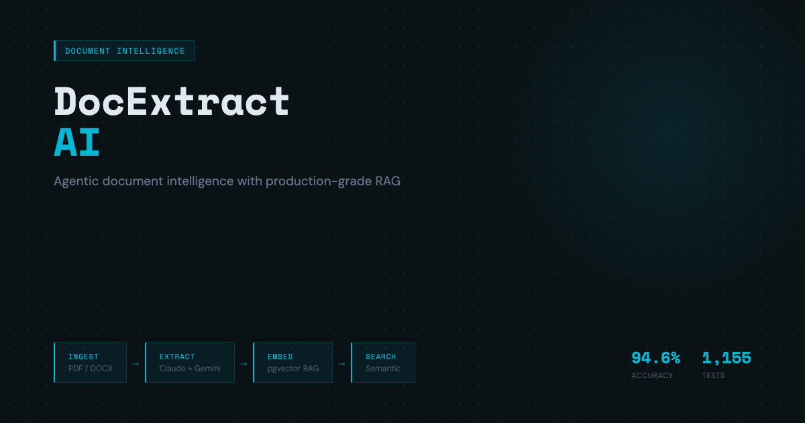
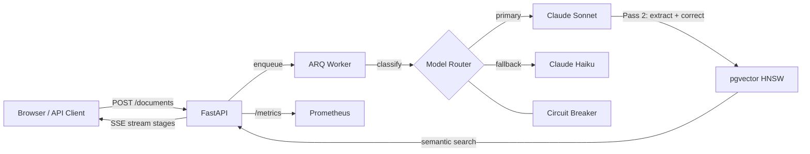

# DocExtract AI

**Extract structured data from unstructured documents in seconds -- not hours.**

[](https://github.com/ChunkyTortoise/docextract/actions/workflows/ci.yml)
[](https://github.com/ChunkyTortoise/docextract/actions/workflows/eval-gate.yml)
[](https://codecov.io/gh/ChunkyTortoise/docextract)
[](LICENSE)
[](https://python.org)
[](https://fastapi.tiangolo.com)
[](https://docextract-demo.streamlit.app)

> **Proof in 30 seconds** -- 95.5% extraction F1 | $0.03/doc avg cost | p95 latency 4.1s | 1,253 tests | 74 eval cases | live demo

| Metric | Value |
|--------|-------|
| Extraction accuracy (F1) | **95.5%** |
| Avg cost per document | **$0.03** |
| p95 end-to-end latency | **4.1s** |
| Straight-through rate | **88%** |
| Test suite | **1,253 tests** |
| Eval framework | **LLM-as-judge + promptfoo CI gate** |

**Key features:** instructor typed extraction with auto-retry, LLM-as-judge online quality scoring (10% sampling), hybrid RRF retrieval, vision extraction mode, business metrics API, 15-page Streamlit dashboard

> **Best fit** -- AI Engineer, Applied AI Engineer, AI Backend Engineer

## What's New (April 2026)

| Feature | ADR | Impact |
|---------|-----|--------|
| **Anthropic Prompt Caching** | [ADR-0015](docs/adr/0015-prompt-caching.md) | ~60% eval cost reduction; cache_creation_tokens tracked in OTel |
| **Native Citations API** | [ADR-0016](docs/adr/0016-native-citations.md) | Character-level grounding for extracted fields — cite the exact source span |
| **Independent LLM Judge (Gemini)** | [ADR-0018](docs/adr/0018-independent-judge-and-multi-provider-router.md) | Eliminates self-grading bias; Gemini 2.5 Flash primary, Claude Haiku fallback |
| **TF-IDF Reranker** | [ADR-0019](docs/adr/0019-reranker-and-agentic-reflection.md) | Replaces no-op stub; combines TF-IDF cosine + retrieval RRF score |
| **Agentic Self-Reflection** | [ADR-0019](docs/adr/0019-reranker-and-agentic-reflection.md) | Low-confidence extractions trigger a reflection + revise pass |

## For Hiring Managers

| If you're evaluating for... | Where to look | Training behind it |
|-----------------------------|--------------|-------------------|
| **AI / ML Engineer** | Agentic RAG ReAct loop ([`app/services/agentic_rag.py`](app/services/agentic_rag.py)), RAGAS evaluation pipeline ([`app/services/ragas_evaluator.py`](app/services/ragas_evaluator.py)), QLoRA fine-tuning pipeline ([`scripts/train_qlora.py`](scripts/train_qlora.py)) — training infrastructure ready, W&B experiment tracking, golden eval CI gate | IBM GenAI Engineering (144h), IBM RAG & Agentic AI (24h), DeepLearning.AI Deep Learning (120h) |
| **Backend / Platform Engineer** | Circuit breaker model fallback ([`app/services/circuit_breaker.py`](app/services/circuit_breaker.py)), async ARQ job queue ([`worker/`](worker/)), prompt versioning, eval CI, and sliding-window rate limiter | Microsoft AI & ML Engineering (75h), Google Cloud GenAI Leader (25h) |
| **Full-Stack AI Engineer** | 15-page Streamlit dashboard ([`frontend/`](frontend/)), SSE streaming progress, MCP tool server ([`mcp_server.py`](mcp_server.py)), interactive demo sandbox | IBM BI Analyst (141h), Google Data Analytics (181h), Microsoft Data Viz (87h) |
| **MLOps / LLMOps Engineer** | Prompt versioning + regression testing ([`app/services/prompt_registry.py`](app/services/prompt_registry.py)), model A/B testing with z-test significance ([`app/services/model_ab_test.py`](app/services/model_ab_test.py)), DeepEval CI gates, cost tracking per request | Duke LLMOps (48h), Google Advanced Data Analytics (200h) |
| **EdTech / LMS Engineer** | Document extraction maps directly to assignment processing and syllabus parsing, batch pipeline ([`worker/`](worker/)) handles grading document ingestion at scale, PII sanitizer ([`app/services/pii_sanitizer.py`](app/services/pii_sanitizer.py)) enforces FERPA compliance for student records | IBM GenAI Engineering (144h), Google Data Analytics (181h) |

→ Supporting background map: [`docs/certifications.md`](docs/certifications.md)

## Quickstart

```bash
git clone https://github.com/ChunkyTortoise/docextract.git
cd docextract
cp .env.example .env  # Add ANTHROPIC_API_KEY + GEMINI_API_KEY
docker compose up -d
open http://localhost:8501  # Streamlit UI
```

Services: API at `:8000` (`/docs` for Swagger) | Frontend at `:8501` | PostgreSQL `:5432` | Redis `:6379`

## Demo

[](https://docextract-demo.streamlit.app)

> First visit may take 30 seconds to wake up. Pre-cached results for invoice, contract, and receipt extraction.

Local demo (no API key needed):

```bash
DEMO_MODE=true streamlit run frontend/app.py
```

## Architecture



## Supported Models

| Model | Provider | Env Var | Notes |
|-------|----------|---------|-------|
| `claude-sonnet-4-6` | Anthropic | `ANTHROPIC_API_KEY` | Default extraction model |
| `claude-haiku-4-5-20251001` | Anthropic | `ANTHROPIC_API_KEY` | Default classification + circuit breaker fallback |
| Gemini (embedding) | Google | `GEMINI_API_KEY` | Used for pgvector embeddings only |

## Screenshots

| Upload & Extraction | Extracted Records & ROI |
|---------------------|------------------------|
|  |  |

### SSE Streaming Demo


*Real-time progress: PREPROCESSING > EXTRACTING > CLASSIFYING > VALIDATING > EMBEDDING > COMPLETED*

## Key Capabilities

- **Extraction**: Two-pass Claude pipeline (draft + verify via `tool_use`), 6 document types, 95.5% extraction F1 on 74-case eval corpus (52 golden + 22 adversarial)
- **Search & RAG**: pgvector semantic search (768-dim HNSW), hybrid BM25+RRF retrieval, agentic ReAct loop with 5 tools, map-reduce multi-document synthesis, semantic deduplication cache
- **Reliability**: Circuit breaker (Sonnet to Haiku fallback), dead-letter queue, idempotent retries, HMAC-signed webhooks with 4-attempt retry, SHA-256 upload dedup
- **Observability**: OpenTelemetry traces (Jaeger/Tempo), Prometheus metrics, Grafana dashboards, per-request cost tracking, structured logging
- **Developer Experience**: SSE streaming progress, MCP server integration, prompt versioning (semver), model A/B testing (z-test), 19 ADRs, 90%+ test coverage

## Performance

| Metric | Value |
|--------|-------|
| Document extraction (p50) | ~8s (two-pass Claude) |
| SSE first token (p50) | <500ms |
| Semantic search (p95) | <100ms |
| Extraction accuracy (eval gate) | **95.5%** F1 across 74 cases, 6 document types |
| Test suite | ~5s (1,253 tests) |
| Coverage | 90%+ (CI-enforced) |

## Evaluation Results

74-case corpus: 52 golden + 22 adversarial (prompt injection, PII leak, hallucination bait). Scores are field-level F1. CI-enforced on every PR that touches prompts or extraction services via [`eval-gate.yml`](.github/workflows/eval-gate.yml).

| Document Type | F1 Score |
|---|---|
| Invoice | 97.3% |
| Purchase Order | 97.6% |
| Bank Statement | 95.8% |
| Medical Record | 99.2% |
| Receipt | 91.1% |
| Identity Document | 81.4% |
| **Overall** | **95.5%** |

*Baseline: `autoresearch/baseline.json` (28-case golden set, legacy runner).*

```bash
# Full eval suite (Promptfoo + Ragas + LLM-judge, ~$0.44, ~4 min):
make eval

# Fast eval (Promptfoo only, ~$0.02, ~20s):
make eval-fast
```

For methodology details see [`docs/eval-methodology.md`](docs/eval-methodology.md).

## Project Structure

```
app/
  api/          -- FastAPI route modules (10 routers)
  auth/         -- API key auth + rate limiting middleware
  models/       -- SQLAlchemy models (8 tables)
  schemas/      -- Pydantic request/response schemas
  services/     -- Extraction, classification, embedding, validation
  storage/      -- Pluggable storage backends (local, R2)
  utils/        -- Hashing, MIME detection, token counting
worker/         -- ARQ async job processor
frontend/       -- Streamlit 15-page dashboard
alembic/        -- Database migrations (001-012)
scripts/        -- CLI tools: eval harness, training, seeding, Langfuse sync
tests/          -- Unit, integration, frontend, e2e, and load tests
evals/          -- Golden + adversarial eval corpus (72 cases)
prompts/        -- Versioned prompt templates with CHANGELOG
```

## Architecture Decisions

19 Architecture Decision Records (ADRs) document the key design choices: [docs/adr/](docs/adr/)

| ADR | Decision |
|-----|----------|
| [ADR-0001](docs/adr/0001-arq-over-celery.md) | ARQ over Celery for async job queue |
| [ADR-0002](docs/adr/0002-pgvector-over-dedicated-vector-db.md) | pgvector over Pinecone/Weaviate |
| [ADR-0003](docs/adr/0003-two-pass-extraction.md) | Two-pass Claude extraction with confidence gating |
| [ADR-0006](docs/adr/0006-circuit-breaker-model-fallback.md) | Circuit breaker model fallback chain |
| [ADR-0011](docs/adr/0011-api-key-auth-over-oauth-jwt.md) | API key auth over OAuth/JWT |
| [ADR-0012](docs/adr/0012-pluggable-storage-local-r2.md) | Pluggable storage backend (Local/R2) |
| [ADR-0015](docs/adr/0015-prompt-caching.md) | Anthropic prompt caching — 60%+ eval cost reduction |
| [ADR-0016](docs/adr/0016-native-citations.md) | Native Citations API for character-level grounding |
| [ADR-0018](docs/adr/0018-independent-judge-and-multi-provider-router.md) | Gemini 2.5 as independent judge (eliminates self-grading bias) |
| [ADR-0019](docs/adr/0019-reranker-and-agentic-reflection.md) | TF-IDF reranker + agentic self-reflection loop |

## Production Readiness

Runs locally via Docker Compose. Reference Kubernetes and AWS Terraform configs are included for future deployment work, but the clearest production-facing proof here is the live demo, observability stack, and CI-enforced eval gate.

**Cloud infrastructure** ([`deploy/aws/main.tf`](deploy/aws/main.tf), [`deploy/k8s/`](deploy/k8s/)): Reference AWS Terraform and Kubernetes configs are included for infrastructure direction, along with Docker Compose for local end-to-end runs.

| Document | Purpose |
|----------|---------|
| [SLO Targets](docs/slo.md) | Latency, availability, quality, cost targets |
| [Common Failure Runbook](docs/runbooks/common-failures.md) | Circuit breaker, Redis, DB, queue, vector index recovery |
| [Security Guide](docs/SECURITY.md) | API keys, webhooks, CORS, data handling |
| [Compliance & Privacy](docs/COMPLIANCE.md) | Privacy controls, PII handling notes, and compliance considerations |
| [Architecture](docs/ARCHITECTURE.md) | Full system architecture overview |
| [Case Study](CASE_STUDY.md) | Engineering journey from prototype to production |
| [MCP Integration](docs/mcp-integration.md) | Claude Desktop / agent framework setup |
| [Cost Model](docs/cost-model.md) | Token costs, per-document pricing, volume estimates |
| [Certifications Applied](docs/certifications.md) | Supporting background mapped to implementation areas |

## Deployment

**Render (one-click):** [](https://render.com/deploy?repo=https://github.com/ChunkyTortoise/docextract)

**Kubernetes:** `kubectl apply -k deploy/k8s/` (HPA auto-scaling, nginx ingress, SSE buffering disabled)

**AWS Terraform:** `cd deploy/aws && terraform apply` (EC2 + RDS PostgreSQL 16 + ElastiCache Redis 7, free-tier eligible)

See [deploy/](deploy/) for full manifests and configuration.

## Running Tests

```bash
pytest tests/ -v                      # Full suite (1,253 tests, ~5s)
pytest tests/ -v --run-eval           # Include golden eval (requires API key)
python scripts/run_eval_ci.py --ci    # Deterministic eval (no API key)
```

## Known Limitations

- **Tesseract degradation on handwriting**: OCR accuracy drops significantly on handwritten documents. Set `OCR_ENGINE=vision` to route through Claude's vision API instead.
- **English-only extraction prompts**: Non-English documents may extract with lower accuracy.

## Contributing

See [CONTRIBUTING.md](CONTRIBUTING.md) for development setup, testing, and PR guidelines.

## License

MIT
