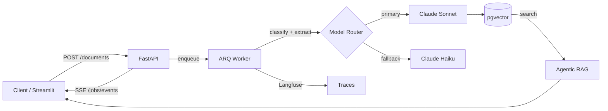

# DocExtract AI

> **Ship-gate first:** versioned eval corpus, offline replay, variance-calibrated CI — then two-pass extraction, agentic RAG, and a live demo.

[](https://github.com/ChunkyTortoise/docextract/actions/workflows/ci.yml)
[](https://github.com/ChunkyTortoise/docextract/actions/workflows/eval-gate.yml)
[](https://python.org)

**Reviewer path (about two minutes, no API key):** follow [DEMO.md](DEMO.md) or the [live Streamlit demo](https://docextract-demo.streamlit.app). Screen-recording URL added only after an owner records it ([checklist](docs/media/VIDEO-HUMAN-CHECKLIST.md)).

Static marketing front door: [`site/`](site/) (HTML + CSS, no build step).

## Eval gate {#eval-gate}

Prompts are code. DocExtract treats extraction quality as a **merge-blocking CI signal**, not a post-hoc dashboard number.

| Signal | What runs | When |
|--------|-----------|------|
| **Offline replay** (badge driver) | `scripts/eval_offline_replay.py` on 28 committed fixtures | Every eval-gated PR; zero API cost |
| **Variance-calibrated gate** | `scripts/eval_gate.py` vs `autoresearch/baseline.json` | PRs touching prompts / extraction services |
| **Paid live eval** | Promptfoo, RAGAS, LLM-judge | Only when `ANTHROPIC_API_KEY` is present in CI; skipped otherwise |
| **Drift cron** | Golden set vs production prompt version | Daily 13:23 UTC |

**Eval gate proof (red blocked PR):** [#32 — intentional regression (keep open / expect red)](https://github.com/ChunkyTortoise/docextract/pull/32). See also [docs/eval-methodology.md](docs/eval-methodology.md).

| Metric | Value | Basis |
|--------|-------|-------|
| Extraction accuracy (field-level, critical fields weighted 2×) | **95.5%** | Always-on CI offline replay of **28** deterministic fixtures (`scripts/eval_offline_replay.py`); not a paid live grade |
| Test suite | **1,366 collected tests**, 80% CI coverage gate | `pytest tests/ --collect-only`; gate `--cov-fail-under=80` ([portfolio-metrics.yaml](docs/portfolio-metrics.yaml)) |
| Eval corpus | **200 cases** (150 golden + 50 adversarial) | 28 deterministic-replay in CI + remainder live-metered when API budget attached |
| Cost / latency | See [cost-model.md](docs/cost-model.md) | Modeled only until a funded `scripts/benchmark.py` run is committed |

<details>
<summary>CI-replayed eval breakdown by document type (from committed <code>autoresearch/baseline.json</code>)</summary>

| Document type | Score | Cases |
|---|---|---|
| invoice | 0.9731 | 13 |
| receipt | 0.9107 | 4 |
| purchase_order | 0.9762 | 3 |
| bank_statement | 0.9581 | 4 |
| medical_record | 0.9923 | 3 |
| identity_document | 0.8139 | 1 |

Overall: 0.955 across 28 cases, replayed on every eval-gated PR at zero API cost.

</details>

More: [CASE_STUDY.md](CASE_STUDY.md) · [docs/eval-methodology.md](docs/eval-methodology.md) · [evals/](evals/)

## What this does

FastAPI document intelligence: upload PDFs and images, classify with cost-aware routing, extract structured fields via a **two-pass Claude pipeline**, embed into **pgvector**, and query with **agentic RAG** (ReAct loop with streaming SSE reasoning).

```
Upload → ARQ worker → classify → extract → validate → embed → search / agentic RAG
         ↑
    Langfuse traces (live)          Offline eval replay (CI only — not on request path)
```

## Why this is interesting (engineering)

- **Eval-gated CI**: `eval-gate.yml` offline job replays 28-case deterministic baseline at zero API cost; PRs touching prompts or extraction services must pass before merge
- **Agentic RAG**: ReAct Think → Act → Observe over hybrid retrieval tools; primary search story in API and Streamlit ([`agentic_rag.py`](app/services/agentic_rag.py), [`agent_trace.py`](frontend/pages/agent_trace.py))
- **Cost-aware model routing**: Haiku for classification, Sonnet for extraction; prompt caching on system prompts; circuit breaker with Haiku fallback
- **Independent judge**: Gemini grades extractions to reduce self-grading bias ([ADR-0018](docs/adr/0018-independent-judge-and-multi-provider-router.md))
- **Langfuse observability**: primary spine for live extraction traces, prompt registry, and eval-run debugging ([`app/observability.py`](app/observability.py))
- **Prompt-injection defense**: runtime fence + scan + output sanitization ([ADR-0020](docs/adr/0020-indirect-prompt-injection-defense.md))

## Architecture



## Demo

[Live demo](https://docextract-demo.streamlit.app) on Streamlit Cloud (allow about a minute cold start). Or run locally with no API key:

```bash
DEMO_MODE=true streamlit run frontend/app.py
```

Progress streams over SSE: `/jobs/{id}/events` (extraction stages) and `/agent-search/stream` (agentic retrieval reasoning).

## Install

```bash
git clone https://github.com/ChunkyTortoise/docextract.git
cd docextract
cp .env.example .env  # Add ANTHROPIC_API_KEY + GEMINI_API_KEY
docker compose up -d
open http://localhost:8501  # Streamlit UI
```

Services: API `:8000` (`/docs` for Swagger) | Frontend `:8501` | PostgreSQL `:5432` | Redis `:6379`

## Tests

```bash
pytest tests/ --collect-only -q       # 1,366 collected tests
python scripts/eval_offline_replay.py --floor 0.85   # Always-on CI offline replay (badge driver)
python scripts/run_eval_ci.py --ci                    # Wrapper; same 28-case deterministic path
make eval                             # Full eval suite (~$0.44, ~4 min)
```

## Architecture Decisions

20 ADRs at [docs/adr/](docs/adr/). Key decisions:

| ADR | Decision |
|-----|----------|
| [ADR-0003](docs/adr/0003-two-pass-extraction.md) | Two-pass Claude extraction with confidence gating |
| [ADR-0006](docs/adr/0006-circuit-breaker-model-fallback.md) | Circuit breaker model fallback chain |
| [ADR-0015](docs/adr/0015-prompt-caching.md) | Anthropic prompt caching for eval cost reduction |
| [ADR-0018](docs/adr/0018-independent-judge-and-multi-provider-router.md) | Gemini as independent judge |
| [ADR-0019](docs/adr/0019-reranker-and-agentic-reflection.md) | TF-IDF reranker + agentic self-reflection loop |

**Scope notes (honest):** GraphRAG hybrid retrieval is opt-in (`GRAPH_RETRIEVAL_ENABLED=false` by default): regex entity graph, file-backed — see [`app/services/graph_rag/`](app/services/graph_rag/). Semantic cache ([ADR-0017](docs/adr/0017-semantic-cache-l1-l2.md)) is implemented but feature-flagged off and not wired into the extraction hot path. LangSmith and OpenTelemetry exporters exist for optional ops wiring; **Langfuse is the primary observability story** for reviewers.

More: [DEMO.md](DEMO.md) | [docs/cost-model.md](docs/cost-model.md) | [site/](site/)

## License

MIT
