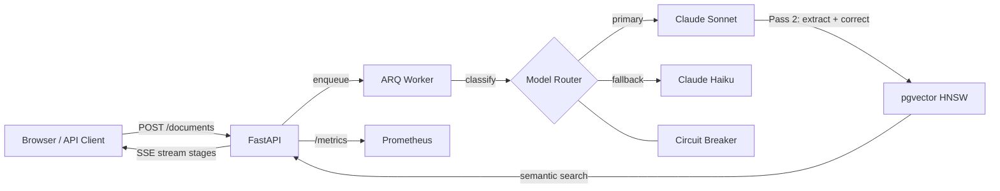

# DocExtract AI

**Extract structured data from unstructured documents in seconds, not hours.**

[](https://github.com/ChunkyTortoise/docextract/actions/workflows/ci.yml)
[](https://github.com/ChunkyTortoise/docextract/actions/workflows/eval-gate.yml)
[](https://codecov.io/gh/ChunkyTortoise/docextract)
[](LICENSE)
[](https://python.org)
[](https://fastapi.tiangolo.com)
[](https://docextract-demo.streamlit.app)

## What this is

DocExtract is a portfolio project I built to learn how a real RAG extraction system fits together: ingest a messy PDF, classify it, pull structured fields with Claude, embed the text into pgvector, and measure whether the answers are any good. The repo focuses on the parts of an LLM pipeline I wanted hands-on practice with: eval gating in CI, cost tracking from token counts, hybrid retrieval, and an independent judge so I'm not grading my own homework.

Live demo: [docextract-demo.streamlit.app](https://docextract-demo.streamlit.app). Local demo (no API key) below.

Targeted roles: AI Engineer.

### Numbers I can defend

| Metric | Value | Basis |
|--------|-------|-------|
| Extraction accuracy (F1) | **95.5%** | Measured. CI-replayed from committed fixtures over a 28-case subset, zero API cost. The full 72-case corpus is committed but not yet end-to-end metered. |
| Avg cost per document | **~$0.03** | Modeled from token pricing and call distribution ([cost-model.md](docs/cost-model.md)). Not yet metered against a live billing total. |
| p95 end-to-end latency | **~4.1s** | Modeled. Pending a metered `scripts/benchmark.py` run. |
| Straight-through rate | **~88%** | Modeled. Pending real production traces. |
| Test suite | **1,280 collected tests** | Measured. 1,273 passing, 81% coverage on the latest local run. |
| Eval framework | LLM-as-judge + promptfoo CI gate + offline replay | Code: `scripts/eval_*.py` |

I want to keep "measured" and "modeled" labels separate so the table stays honest under scrutiny. The single biggest weakness in this set is that cost and latency are still modeled, not metered (see "What's solid, what's still rough" below).

### Modeled cost breakdown (~$0.03/doc)

Token pricing times call distribution. Reproduce as metered numbers with `scripts/benchmark.py` once an API budget is attached.

| Stage | Model | Avg cost | Notes |
|-------|-------|----------|-------|
| Classification | Claude Haiku 4.5 | $0.0003 to $0.001 | Haiku routing saves ~67% vs Sonnet; A/B z-test confirmed <2% quality loss |
| Extraction | Claude Sonnet 4.6 | $0.004 to $0.012 | Prompt caching (ADR-0015) cuts repeat-call cost ~60% on runs >5 docs |
| Self-reflection (12% of docs) | Claude Sonnet 4.6 | +20% base cost | Triggered by low-confidence threshold; 88% of docs skip this pass |
| LLM judge | Gemini 2.5 Flash | ~$0.001 | 10% sampling; independent grader removes self-grading bias |
| **Per-document total (avg)** | | **~$0.03** | |

Per-call token usage and cache hits are captured by [`app/services/llm_tracer.py`](app/services/llm_tracer.py) and exported as OpenTelemetry metrics (`prompt_cache_read_tokens_total`, `prompt_cache_creation_tokens_total`, plus LLM latency/token counters) via [`app/observability.py`](app/observability.py). Per-request USD cost is then computed from those token counts by [`app/services/cost_tracker.py`](app/services/cost_tracker.py) against the in-repo pricing table; methodology in [`docs/cost-model.md`](docs/cost-model.md).

## What I learned building this

| Topic | Where it shows up |
|-------|-------------------|
| Hybrid retrieval (BM25 + vector + RRF) | [`app/services/rag_tools.py`](app/services/rag_tools.py), [`app/services/bm25.py`](app/services/bm25.py) |
| TF-IDF reranking on top of RRF | [`app/services/reranker.py`](app/services/reranker.py) |
| Independent LLM judge to avoid self-grading bias | [`app/services/llm_judge.py`](app/services/llm_judge.py) (Gemini 2.5 Flash judging a Claude extractor), ADR-0018 |
| RAGAS-style metrics (context recall, faithfulness, answer relevancy) | [`app/services/ragas_evaluator.py`](app/services/ragas_evaluator.py) |
| Eval gating in CI without spending API budget | [`scripts/eval_offline_replay.py`](scripts/eval_offline_replay.py), `eval-gate.yml` |
| Prompt versioning and regression testing | [`app/services/prompt_registry.py`](app/services/prompt_registry.py), [`app/services/prompt_regression.py`](app/services/prompt_regression.py) |
| Cost attribution from token counts | [`app/services/cost_tracker.py`](app/services/cost_tracker.py), `docs/cost-model.md` |
| Circuit breaker for model fallback | [`app/services/circuit_breaker.py`](app/services/circuit_breaker.py) |
| Indirect prompt-injection defense (fenced untrusted data) | [`app/services/injection_guard.py`](app/services/injection_guard.py), ADR-0020 |

Background coursework that fed into the above is mapped in [`docs/certifications.md`](docs/certifications.md).

## What's solid, what's still rough

**Solid:**

- Hybrid retrieval with Reciprocal Rank Fusion is implemented end-to-end and unit-tested.
- The offline eval replay runs deterministically in CI on every PR and fails on a >3 point F1 regression vs the committed baseline.
- An independent Gemini judge grades a Claude extractor, so the eval score isn't being produced by the same model that wrote the answer.
- 1,280 tests at 81% coverage, including unit, integration, frontend, e2e, and load.

**Still rough:**

- Chunking is page-marker plus sentence-boundary plus a fixed character overlap. There's no semantic or layout-aware chunking and no ablation showing the current strategy beats naive splitting. This is the first thing I'd change next.
- F1 is replayed against 28 of the 72 corpus cases. The other 44 are committed but not yet scored end-to-end.
- Cost (~$0.03/doc), p95 latency (~4.1s), and straight-through rate (~88%) are modeled from the pricing table and call distribution. Live metered numbers from `scripts/benchmark.py` are pending an API budget.
- Some reliability features (circuit breaker, semantic L1+L2 cache, MCP server) are flag-gated and not exercised by the default CI path. They are real code, not stubs, but I haven't run them under load.
- Tesseract OCR drops accuracy on handwriting. The workaround is `OCR_ENGINE=vision` to route through Claude's vision API.
- Extraction prompts are English-only.

## Recent engineering decisions

| Feature | ADR | What it does |
|---------|-----|-------------|
| Anthropic Prompt Caching | [ADR-0015](docs/adr/0015-prompt-caching.md) | ~60% eval cost reduction on repeat calls; `cache_creation_tokens` tracked in OTel |
| Native Citations API | [ADR-0016](docs/adr/0016-native-citations.md) | Character-level grounding for extracted fields (cite the exact source span) |
| Independent LLM Judge (Gemini) | [ADR-0018](docs/adr/0018-independent-judge-and-multi-provider-router.md) | Eliminates self-grading bias; Gemini 2.5 Flash primary, Claude Haiku fallback |
| TF-IDF Reranker | [ADR-0019](docs/adr/0019-reranker-and-agentic-reflection.md) | Replaces no-op stub; combines TF-IDF cosine with retrieval RRF score |
| Agentic Self-Reflection | [ADR-0019](docs/adr/0019-reranker-and-agentic-reflection.md) | Low-confidence extractions trigger a reflection and revise pass |

## Quickstart

```bash
git clone https://github.com/ChunkyTortoise/docextract.git
cd docextract
cp .env.example .env  # Add ANTHROPIC_API_KEY + GEMINI_API_KEY
docker compose up -d
open http://localhost:8501  # Streamlit UI
```

Services: API at `:8000` (`/docs` for Swagger), Frontend at `:8501`, PostgreSQL `:5432`, Redis `:6379`.

## Demo

[](https://docextract-demo.streamlit.app)

> First visit may take 30 seconds to wake up. Pre-cached results for invoice, contract, and receipt extraction.

Local demo (no API key needed):

```bash
DEMO_MODE=true streamlit run frontend/app.py
```

## Architecture



## Supported models

| Model | Provider | Env Var | Notes |
|-------|----------|---------|-------|
| `claude-sonnet-4-6` | Anthropic | `ANTHROPIC_API_KEY` | Default extraction model |
| `claude-haiku-4-5-20251001` | Anthropic | `ANTHROPIC_API_KEY` | Default classification + circuit breaker fallback |
| Gemini (embedding) | Google | `GEMINI_API_KEY` | Used for pgvector embeddings only |

## Screenshots

| Upload & Extraction | Extracted Records & ROI |
|---------------------|------------------------|
|  |  |

### SSE streaming demo


*Real-time progress: PREPROCESSING > EXTRACTING > CLASSIFYING > VALIDATING > EMBEDDING > COMPLETED*

## Key capabilities

- **Extraction**: Two-pass Claude pipeline (draft and verify via `tool_use`), 6 document types, 95.5% accepted extraction F1 baseline with a 72-case eval corpus (51 golden + 21 adversarial).
- **Search and RAG**: pgvector semantic search (768-dim HNSW), hybrid BM25+RRF retrieval, agentic ReAct loop with 5 tools, map-reduce multi-document synthesis, semantic deduplication cache.
- **Reliability**: Circuit breaker (Sonnet to Haiku fallback), dead-letter queue, idempotent retries, HMAC-signed webhooks with 4-attempt retry, SHA-256 upload dedup.
- **Observability**: OpenTelemetry traces (Jaeger/Tempo), Prometheus metrics, Grafana dashboards, per-request cost tracking, structured logging.
- **Developer experience**: SSE streaming progress, MCP server integration, prompt versioning (semver), model A/B testing (z-test), 19 ADRs, 81.59% latest local coverage with an 80% CI gate.

## Performance

| Metric | Value |
|--------|-------|
| Document extraction (p50) | ~8s (two-pass Claude) |
| SSE first token (p50) | <500ms |
| Semantic search (p95) | <100ms |
| Extraction accuracy (eval gate) | **95.5%** accepted F1 baseline (`autoresearch/baseline.json`, 28 scored cases) |
| Eval corpus | 72 scored cases: 51 golden + 21 adversarial |
| Test suite | 1,280 collected tests; latest local run: 1,273 passed, 5 skipped, 2 deselected |
| Coverage | 81.59% latest local coverage; 80% CI gate |

## Evaluation results

Current eval corpus: 72 scored cases, 51 golden + 21 adversarial (prompt injection, PII leak, hallucination bait). The accepted F1 baseline is stored in [`autoresearch/baseline.json`](autoresearch/baseline.json), and quality checks run on every PR that touches prompts or extraction services via [`eval-gate.yml`](.github/workflows/eval-gate.yml). Failure modes and next experiments I want to try are tracked in [`docs/eval-failure-analysis.md`](docs/eval-failure-analysis.md).

| Document Type | F1 Score |
|---|---|
| Invoice | 97.3% |
| Purchase Order | 97.6% |
| Bank Statement | 95.8% |
| Medical Record | 99.2% |
| Receipt | 91.1% |
| Identity Document | 81.4% |
| **Overall** | **95.5%** |

*Baseline: `autoresearch/baseline.json` (28-case baseline: 16 golden + 12 adversarial, legacy runner).*

```bash
# Full eval suite (Promptfoo + Ragas + LLM-judge, ~$0.44, ~4 min):
make eval

# Fast eval (Promptfoo only, ~$0.02, ~20s):
make eval-fast
```

For methodology details see [`docs/eval-methodology.md`](docs/eval-methodology.md).

## Project structure

```
app/
  api/          -- FastAPI route modules (10 routers)
  auth/         -- API key auth + rate limiting middleware
  models/       -- SQLAlchemy models (8 tables)
  schemas/      -- Pydantic request/response schemas
  services/     -- Extraction, classification, embedding, validation
  storage/      -- Pluggable storage backends (local, R2)
  utils/        -- Hashing, MIME detection, token counting
worker/         -- ARQ async job processor
frontend/       -- Streamlit 15-page dashboard
alembic/        -- Database migrations (001-012)
scripts/        -- CLI tools: eval harness, training, seeding, Langfuse sync
tests/          -- Unit, integration, frontend, e2e, and load tests
evals/          -- Golden + adversarial eval corpus (72 scored cases)
prompts/        -- Versioned prompt templates with CHANGELOG
```

## Architecture decisions

19 Architecture Decision Records document the key design choices: [docs/adr/](docs/adr/)

| ADR | Decision |
|-----|----------|
| [ADR-0001](docs/adr/0001-arq-over-celery.md) | ARQ over Celery for async job queue |
| [ADR-0002](docs/adr/0002-pgvector-over-dedicated-vector-db.md) | pgvector over Pinecone/Weaviate |
| [ADR-0003](docs/adr/0003-two-pass-extraction.md) | Two-pass Claude extraction with confidence gating |
| [ADR-0006](docs/adr/0006-circuit-breaker-model-fallback.md) | Circuit breaker model fallback chain |
| [ADR-0011](docs/adr/0011-api-key-auth-over-oauth-jwt.md) | API key auth over OAuth/JWT |
| [ADR-0012](docs/adr/0012-pluggable-storage-local-r2.md) | Pluggable storage backend (Local/R2) |
| [ADR-0015](docs/adr/0015-prompt-caching.md) | Anthropic prompt caching (~60% eval cost reduction) |
| [ADR-0016](docs/adr/0016-native-citations.md) | Native Citations API for character-level grounding |
| [ADR-0017](docs/adr/0017-semantic-cache-l1-l2.md) | Two-layer semantic cache (L1 exact hash + L2 embedding similarity) |
| [ADR-0018](docs/adr/0018-independent-judge-and-multi-provider-router.md) | Gemini 2.5 as independent judge (eliminates self-grading bias) |
| [ADR-0019](docs/adr/0019-reranker-and-agentic-reflection.md) | TF-IDF reranker + agentic self-reflection loop |

## Deployment

Runs locally via Docker Compose: `docker compose up -d` brings up the API, worker, Streamlit frontend, Postgres, and Redis together.

Reference Kubernetes (`deploy/k8s/`, kustomize), AWS Terraform (`deploy/aws/`), and Fly.io (`fly.toml`) manifests are committed as a learning exercise for future deployment work. They are not exercised by CI today; the live-facing surface here is the Streamlit demo, the observability stack, and the CI eval gate.

Render one-click demo: [](https://render.com/deploy?repo=https://github.com/ChunkyTortoise/docextract)

Supporting docs:

| Document | Purpose |
|----------|---------|
| [SLO Targets](docs/slo.md) | Latency, availability, quality, cost targets I aimed for |
| [Common Failure Runbook](docs/runbooks/common-failures.md) | Circuit breaker, Redis, DB, queue, vector index recovery |
| [Security Guide](docs/SECURITY.md) | API keys, webhooks, CORS, data handling |
| [Compliance & Privacy](docs/COMPLIANCE.md) | Privacy controls, PII handling notes, and compliance considerations |
| [Architecture](docs/ARCHITECTURE.md) | Full system architecture overview |
| [Case Study](CASE_STUDY.md) | How the project evolved from prototype to its current state |
| [Demo Walkthrough](DEMO.md) | Five-minute live/local demo path for reviewers |
| [Portfolio Metrics](docs/portfolio-metrics.yaml) | Canonical source for the metric claims in this README |
| [MCP Integration](docs/mcp-integration.md) | Claude Desktop / agent framework setup |
| [Cost Model](docs/cost-model.md) | Token costs, per-document pricing, volume estimates |
| [Certifications Applied](docs/certifications.md) | Supporting background mapped to implementation areas |

## Running tests

```bash
pytest tests/ -v                      # Full suite (1,280 collected tests)
pytest tests/ -v --run-eval           # Include golden eval (requires API key)
python scripts/run_eval_ci.py --ci    # Deterministic eval (no API key)
```

## Contributing

See [CONTRIBUTING.md](CONTRIBUTING.md) for development setup, testing, and PR guidelines.

## License

MIT
