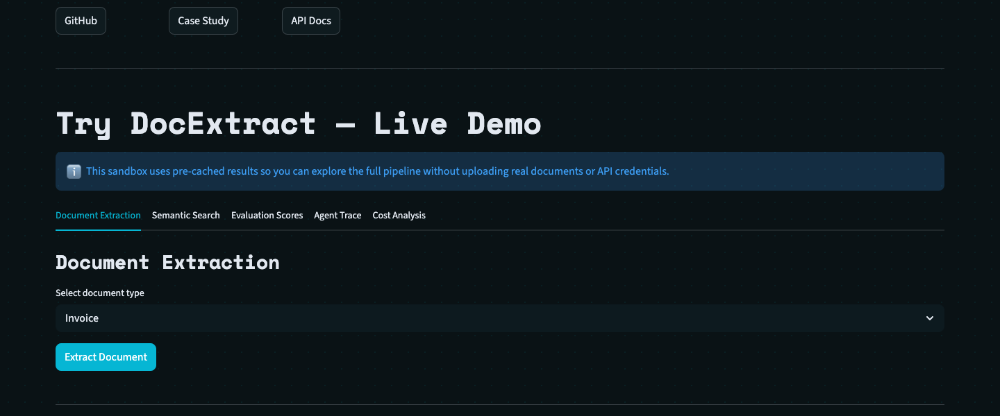
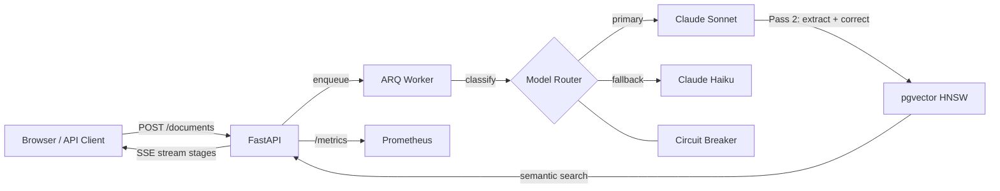

# DocExtract AI

> Document-extraction RAG system: turns messy PDFs into structured data with eval-gated CI, cost-aware model routing, citation grounding, and a live demo.

[](https://github.com/ChunkyTortoise/docextract/actions/workflows/ci.yml)
[](https://github.com/ChunkyTortoise/docextract/actions/workflows/eval-gate.yml)
[](https://python.org)

**Reviewer path (90–120s, no API key):** follow [DEMO.md](DEMO.md) (live Streamlit or `DEMO_MODE=true`). Screen-recording URL added only after an owner records it.


| Metric | Value | Basis |
|--------|-------|-------|
| Extraction accuracy (field-level, critical fields weighted 2x) | **95.5%** | Always-on CI offline replay of 28 deterministic fixtures (`scripts/eval_offline_replay.py` / `run_eval_ci.py --ci`); not a paid live grade |
| Test suite | **1,354 collected tests**, 80% CI coverage gate | `pytest tests/ --collect-only`; coverage gate `--cov-fail-under=80` |
| Eval corpus | **72 cases** (51 golden + 21 adversarial) | 28 deterministic-replay in CI + 44 live-metered when API budget attached; adversarial set covers injection, PII leak, hallucination bait |
| Cost / latency | See [cost-model.md](docs/cost-model.md) | Modeled only until a funded `scripts/benchmark.py` run is committed ([portfolio-metrics.yaml](docs/portfolio-metrics.yaml)) |


<details>
<summary>CI-replayed eval breakdown by document type (from committed <code>autoresearch/baseline.json</code>)</summary>

| Document type | Score | Cases |
|---|---|---|
| invoice | 0.9731 | 13 |
| receipt | 0.9107 | 4 |
| purchase_order | 0.9762 | 3 |
| bank_statement | 0.9581 | 4 |
| medical_record | 0.9923 | 3 |
| identity_document | 0.8139 | 1 |

Overall: 0.955 across 28 cases, replayed on every eval-gated PR at zero API cost.

</details>

## What this does

FastAPI service that extracts structured data from PDFs and other documents via a two-pass Claude pipeline (draft + verify). Extracted records are embedded in pgvector for semantic search. Merge-safe quality signal is the zero-cost offline replay gate; when `ANTHROPIC_API_KEY` is present, paid live eval jobs (including an independent Gemini judge, [ADR-0018](docs/adr/0018-independent-judge-and-multi-provider-router.md)) also run. The gate fails on >3-point accuracy regression vs baseline.

## Why this is interesting (engineering)

- **Eval-gated CI**: `eval-gate.yml` replays 28-case deterministic baseline at zero API cost via `scripts/eval_offline_replay.py`; PRs touching prompts or extraction services must pass before merge
- **Cost-aware model routing**: Claude Haiku for classification (Haiku-first failover), Sonnet for extraction; prompt caching on system prompts; offline A/B runner in `model_ab_test.py` (not a live traffic split)
- **Independent judge**: Gemini 2.5 Flash grades extractions to eliminate self-grading bias; documented in [ADR-0018](docs/adr/0018-independent-judge-and-multi-provider-router.md)
- **Circuit breaker fallback**: Sonnet → Haiku with dead-letter queue, idempotent retries, and HMAC-signed webhooks
- **OpenTelemetry cost attribution**: per-request USD cost computed from token counts via `app/services/cost_tracker.py`; exported as OTel metrics to Grafana
- **Prompt-injection defense**: runtime fence + scan + output sanitization in [`injection_guard.py`](app/services/injection_guard.py) ([ADR-0020](docs/adr/0020-indirect-prompt-injection-defense.md))
- **Retrieval quality (RAGAS)**: context_recall / faithfulness / answer_relevancy composite in [`ragas_evaluator.py`](app/services/ragas_evaluator.py)


## Why these architecture choices

- **pgvector in Postgres** ([ADR-0002](docs/adr/0002-pgvector-over-dedicated-vector-db.md)): embeddings live in the same ACID transaction as `extracted_records`, so retrieval cannot drift from extraction writes. A dedicated vector DB would add another consistency window for little gain at this corpus size.
- **Two-pass extraction** ([ADR-0003](docs/adr/0003-two-pass-extraction.md)): Pass 2 runs only when quality checks demand it, instead of always paying for a second model call. Measured trigger rate and accuracy lift are recorded in the ADR (not restated here; portfolio metrics ledger gates README numbers).
- **ARQ over Celery** ([ADR-0001](docs/adr/0001-arq-over-celery.md)): async coroutines without a thread pool. Throughput and latency comparison vs Celery is recorded in the ADR load-test section (not restated here until those figures are ledger-status measured).

## Architecture



## Demo

[Live demo](https://docextract-demo.streamlit.app) on Streamlit Cloud (allow about a minute cold start). Or run it locally with no API key:

```bash
DEMO_MODE=true streamlit run frontend/app.py
```

Progress streams over two real Server-Sent Events endpoints: `/jobs/{id}/events` (extraction stages) and `/agent-search/stream` (agentic retrieval reasoning).

## Install

```bash
git clone https://github.com/ChunkyTortoise/docextract.git
cd docextract
cp .env.example .env  # Add ANTHROPIC_API_KEY + GEMINI_API_KEY
docker compose up -d
open http://localhost:8501  # Streamlit UI
```

Services: API `:8000` (`/docs` for Swagger) | Frontend `:8501` | PostgreSQL `:5432` | Redis `:6379`

## Tests

```bash
pytest tests/ --collect-only -q       # 1,354 collected tests
python scripts/run_eval_ci.py --ci    # Deterministic eval (no API key)
make eval                             # Full eval suite (~$0.44, ~4 min)
```

## Architecture Decisions

20 ADRs at [docs/adr/](docs/adr/). Key decisions:

| ADR | Decision |
|-----|----------|
| [ADR-0003](docs/adr/0003-two-pass-extraction.md) | Two-pass Claude extraction with confidence gating |
| [ADR-0006](docs/adr/0006-circuit-breaker-model-fallback.md) | Circuit breaker model fallback chain |
| [ADR-0015](docs/adr/0015-prompt-caching.md) | Anthropic prompt caching for eval cost reduction |
| [ADR-0017](docs/adr/0017-semantic-cache-l1-l2.md) | Two-layer semantic cache (L1 exact hash + L2 embedding similarity) |
| [ADR-0018](docs/adr/0018-independent-judge-and-multi-provider-router.md) | Gemini 2.5 as independent judge (eliminates self-grading bias) |
| [ADR-0019](docs/adr/0019-reranker-and-agentic-reflection.md) | TF-IDF reranker + agentic self-reflection loop |

More: [CASE_STUDY.md](CASE_STUDY.md) | [DEMO.md](DEMO.md) | [docs/eval-methodology.md](docs/eval-methodology.md) | [docs/cost-model.md](docs/cost-model.md)

## License

MIT
