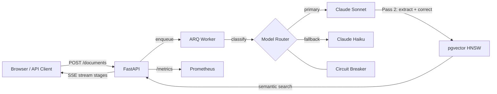

# DocExtract AI

> Production document-extraction RAG system: turns messy PDFs into structured data with eval-gated CI, cost-aware model routing, citation grounding, and a live demo.

[](https://github.com/ChunkyTortoise/docextract/actions/workflows/ci.yml)
[](https://github.com/ChunkyTortoise/docextract/actions/workflows/eval-gate.yml)
[](https://codecov.io/gh/ChunkyTortoise/docextract)
[](LICENSE)
[](https://python.org)

| Metric | Value | Basis |
|--------|-------|-------|
| Extraction accuracy (F1) | **95.5%** | CI-replayed, 28-case deterministic baseline; independent Gemini judge eliminates self-grading bias ([ADR-0018](docs/adr/0018-independent-judge-and-multi-provider-router.md)) |
| Test suite | **1,280 tests, 81% coverage** | 80% CI gate enforced |
| Eval corpus | **72 cases** (51 golden + 21 adversarial) | 28 deterministic-replay in CI + 44 live-metered when API budget attached; adversarial set covers injection, PII leak, hallucination bait |
| Modeled estimates | cost **~$0.03**/doc · latency **~4.1s** p95 | Pricing table x call distribution; reproduce metered numbers with `scripts/benchmark.py` ([cost-model.md](docs/cost-model.md)) |

## What this does

FastAPI service that extracts structured data from PDFs and other documents via a two-pass Claude pipeline (draft + verify). Extracted records are embedded in pgvector for semantic search. Quality is measured continuously by an LLM-as-judge (Gemini 2.5 Flash, 10% sampling) and enforced in CI via an eval gate that fails on >3-point F1 regression.

## Why this is interesting (engineering)

- **Eval-gated CI**: `eval-gate.yml` replays 28-case deterministic baseline at zero API cost via `scripts/eval_offline_replay.py`; PRs touching prompts or extraction services must pass before merge
- **Cost-aware model routing**: Claude Haiku for classification (saves ~67% vs Sonnet, <2% quality loss confirmed by A/B z-test), Sonnet for extraction; prompt caching cuts repeat-call cost ~60%
- **Independent judge**: Gemini 2.5 Flash grades extractions to eliminate self-grading bias; documented in [ADR-0018](docs/adr/0018-independent-judge-and-multi-provider-router.md)
- **Circuit breaker fallback**: Sonnet → Haiku with dead-letter queue, idempotent retries, and HMAC-signed webhooks
- **OpenTelemetry cost attribution**: per-request USD cost computed from token counts via `app/services/cost_tracker.py`; exported as OTel metrics to Grafana

## Architecture



## Demo

[](https://docextract-demo.streamlit.app)


Local demo (no API key needed): `DEMO_MODE=true streamlit run frontend/app.py`

## Install

```bash
git clone https://github.com/ChunkyTortoise/docextract.git
cd docextract
cp .env.example .env  # Add ANTHROPIC_API_KEY + GEMINI_API_KEY
docker compose up -d
open http://localhost:8501  # Streamlit UI
```

Services: API `:8000` (`/docs` for Swagger) | Frontend `:8501` | PostgreSQL `:5432` | Redis `:6379`

## Tests

```bash
pytest tests/ -v                      # 1,280 collected tests
python scripts/run_eval_ci.py --ci    # Deterministic eval (no API key)
make eval                             # Full eval suite (~$0.44, ~4 min)
```

## Architecture Decisions

19 ADRs at [docs/adr/](docs/adr/). Key decisions:

| ADR | Decision |
|-----|----------|
| [ADR-0003](docs/adr/0003-two-pass-extraction.md) | Two-pass Claude extraction with confidence gating |
| [ADR-0006](docs/adr/0006-circuit-breaker-model-fallback.md) | Circuit breaker model fallback chain |
| [ADR-0015](docs/adr/0015-prompt-caching.md) | Anthropic prompt caching -- 60%+ eval cost reduction |
| [ADR-0017](docs/adr/0017-semantic-cache-l1-l2.md) | Two-layer semantic cache (L1 exact hash + L2 embedding similarity) |
| [ADR-0018](docs/adr/0018-independent-judge-and-multi-provider-router.md) | Gemini 2.5 as independent judge (eliminates self-grading bias) |
| [ADR-0019](docs/adr/0019-reranker-and-agentic-reflection.md) | TF-IDF reranker + agentic self-reflection loop |

More: [CASE_STUDY.md](CASE_STUDY.md) | [DEMO.md](DEMO.md) | [docs/eval-methodology.md](docs/eval-methodology.md) | [docs/cost-model.md](docs/cost-model.md)

## License

MIT
