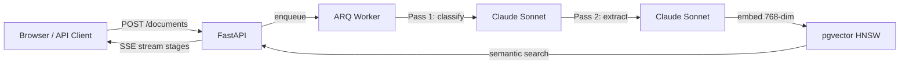

# DocExtract AI

**Extract structured data from unstructured documents in seconds — not hours.**

[](https://github.com/ChunkyTortoise/docextract/actions/workflows/ci.yml)
[](https://github.com/ChunkyTortoise/docextract/actions/workflows/ci.yml)
[](https://docextract-api.onrender.com/docs)
[](https://docextract-api.onrender.com/docs)
[](LICENSE)
[](https://python.org)
[](https://fastapi.tiangolo.com)

## Architecture



## Features

- **5 document types**: PDF, images (PNG/JPEG/TIFF/BMP/GIF/WebP), email (.eml/.msg), and plain text
- **Two-pass Claude extraction**: Pass 1 extracts structured JSON with a confidence score. If confidence < 0.80, Pass 2 fires a `tool_use` correction call for automatic error correction
- **SSE streaming progress**: Real-time job status updates via Server-Sent Events (Redis pub/sub)
- **HNSW vector search**: pgvector semantic search over extracted records (gemini-embedding-2-preview, 768-dim)
- **Human review workflow**: Claim, approve, or correct low-confidence extractions with full audit trail
- **ROI tracking**: Executive report generation with extraction cost/time analytics
- **SHA-256 deduplication**: Identical file uploads return existing job IDs instantly
- **Webhook delivery**: HMAC-SHA256 signed payloads with 4-attempt exponential retry
- **Sliding-window rate limiting**: Per-API-key Redis rate limiter with `X-RateLimit-*` headers
- **AES-GCM encrypted secrets**: Webhook signing secrets encrypted at rest
- **Pluggable storage**: Local filesystem or Cloudflare R2

## Performance

| Metric | Value |
|--------|-------|
| Document extraction (p50) | ~8s (two-pass Claude) |
| SSE first token (p50) | <500ms |
| Semantic search (p95) | <100ms |
| Test suite | ~2s (352 tests) |
| Coverage | ≥80% (CI-enforced) |

## Try It Now

```bash
# Health check (no auth)
curl https://docextract-api.onrender.com/api/v1/health

# List records (demo key)
curl -H "X-API-Key: demo-key-docextract-2026" \
  https://docextract-api.onrender.com/api/v1/records
```

## Deploy Your Own

[](https://render.com/deploy?repo=https://github.com/ChunkyTortoise/docextract)

One-click deploy via Render Blueprint. Sets `DEMO_MODE=true` automatically. You only need to add your `ANTHROPIC_API_KEY`.

## API Reference

All endpoints are prefixed with `/api/v1`. Authenticated endpoints require `X-API-Key` header.

| Method | Path | Auth | Description |
|--------|------|------|-------------|
| `GET` | `/health` | No | Basic health check |
| `GET` | `/health/detailed` | No | Health with DB/Redis/storage status |
| `POST` | `/documents/upload` | Yes | Upload a document for extraction (202) |
| `POST` | `/documents/batch` | Yes | Batch upload multiple documents (202) |
| `DELETE` | `/documents/{document_id}` | Yes | Delete a document and its data |
| `GET` | `/jobs` | Yes | List jobs with optional status filter |
| `GET` | `/jobs/{job_id}` | Yes | Get job status and details |
| `GET` | `/jobs/{job_id}/record` | Yes | Get extracted record for a job |
| `PATCH` | `/jobs/{job_id}` | Yes | Cancel a running job |
| `GET` | `/jobs/{job_id}/events` | Yes | SSE stream of job progress events |
| `GET` | `/records` | Yes | List extracted records (paginated) |
| `GET` | `/records/search` | Yes | Semantic search over records |
| `GET` | `/records/export` | Yes | Stream records as CSV or JSON |
| `GET` | `/records/{record_id}` | Yes | Get a single extracted record |
| `PATCH` | `/records/{record_id}/review` | Yes | Submit review for a record |
| `POST` | `/webhooks/test` | Yes | Send a test webhook payload |
| `GET` | `/stats` | Yes | Aggregate dashboard statistics |
| `POST` | `/api-keys` | Admin | Create a new API key |
| `GET` | `/api-keys` | Admin | List all API keys |
| `DELETE` | `/api-keys/{key_id}` | Admin | Revoke an API key |
| `GET` | `/review/items` | Yes | List review queue items |
| `POST` | `/review/items/{item_id}/claim` | Yes | Claim a review item |
| `POST` | `/review/items/{item_id}/approve` | Yes | Approve a review item |
| `POST` | `/review/items/{item_id}/correct` | Yes | Submit corrections for a review item |
| `GET` | `/review/metrics` | Yes | Review queue metrics |
| `GET` | `/roi/summary` | Yes | ROI summary with date range filter |
| `GET` | `/roi/trends` | Yes | ROI trends by week or month |
| `POST` | `/reports/generate` | Admin | Generate an executive report |
| `GET` | `/reports` | Admin | List generated reports |
| `GET` | `/reports/{report_id}` | Admin | Get a specific report |

## Quickstart

```bash
git clone https://github.com/ChunkyTortoise/docextract.git
cd docextract
cp .env.example .env  # fill in ANTHROPIC_API_KEY + GEMINI_API_KEY at minimum
alembic upgrade head   # apply database migrations
docker-compose up
```

Services start on:
- **API**: http://localhost:8000 (docs at `/docs`)
- **Frontend**: http://localhost:8501
- **PostgreSQL**: localhost:5432
- **Redis**: localhost:6379

Seed a dev API key:

```bash
docker-compose exec api python -m scripts.seed_api_key
```

## Environment Variables

| Variable | Required | Description |
|----------|----------|-------------|
| `DATABASE_URL` | Yes | PostgreSQL connection string (asyncpg driver added automatically) |
| `REDIS_URL` | Yes | Redis connection string |
| `ANTHROPIC_API_KEY` | Yes | Anthropic API key for Claude extraction |
| `API_KEY_SECRET` | Yes | Secret for hashing API keys (32+ chars) |
| `AES_KEY` | No | Base64-encoded 32-byte key for AES-GCM webhook secret encryption |
| `GEMINI_API_KEY` | Yes | Required for Gemini embeddings |
| `STORAGE_BACKEND` | No | `local` (default) or `r2` |
| `STORAGE_LOCAL_PATH` | No | Local file storage path (default: `./storage/local`) |
| `R2_ACCOUNT_ID` | No | Cloudflare R2 account ID |
| `R2_ACCESS_KEY_ID` | No | Cloudflare R2 access key |
| `R2_SECRET_ACCESS_KEY` | No | Cloudflare R2 secret key |
| `R2_BUCKET_NAME` | No | R2 bucket name (default: `docextract`) |
| `CORS_ORIGINS` | No | JSON array of allowed origins |
| `LOG_LEVEL` | No | Logging level (default: `INFO`) |
| `MAX_FILE_SIZE_MB` | No | Max upload size in MB (default: `50`) |
| `MAX_PAGES` | No | Max PDF pages to process (default: `100`) |
| `OCR_ENGINE` | No | `tesseract` or `paddle` (default: `tesseract`) |
| `EXTRACTION_CONFIDENCE_THRESHOLD` | No | Two-pass threshold (default: `0.8`) |
| `DEMO_MODE` | No | Enable demo mode with read-only access (default: `false`) |
| `DEMO_API_KEY` | No | API key for demo access (default: `demo-key-docextract-2026`) |

## Running Tests

```bash
pytest tests/ -v  # 352 tests, ~2s
```

## Project Structure

```
app/
  api/          -- FastAPI route modules (10 routers)
  auth/         -- API key auth + rate limiting middleware
  models/       -- SQLAlchemy models (8 tables)
  schemas/      -- Pydantic request/response schemas
  services/     -- Extraction, classification, embedding, validation
  storage/      -- Pluggable storage backends (local, R2)
  utils/        -- Hashing, MIME detection, token counting
worker/         -- ARQ async job processor
frontend/       -- Streamlit 6-page dashboard
alembic/        -- Database migrations (001-003)
scripts/        -- Seed scripts (API keys, sample docs, cleanup)
tests/          -- Unit + integration tests
```

## Live Demo

- **API**: https://docextract-api.onrender.com
- **Frontend**: https://docextract-frontend.onrender.com
- **Dev API key**: [set in Render dashboard]
- **Docs**: https://docextract-api.onrender.com/docs

## Technical Deep Dive

For a detailed breakdown of the architecture decisions, RAG pipeline design, extraction accuracy benchmarks, and async job queue patterns, see the [Case Study](CASE_STUDY.md). This document covers the full engineering journey from prototype to production.

## Certifications Applied

Skills from completed certifications applied in this project:

| Domain Pillar | Certifications | Applied In |
|--------------|----------------|------------|
| GenAI & LLM Engineering | Google Generative AI, Anthropic Prompt Engineering, DeepLearning.AI LLM courses | Two-pass Claude extraction pipeline, schema-guided prompting |
| RAG & Knowledge Systems | DeepLearning.AI RAG courses, LangChain & Vector DBs | pgvector HNSW semantic search, 768-dim embeddings |
| Cloud & MLOps | Google Cloud, IBM DevOps, GitHub Actions CI/CD | ARQ background workers, Render Blueprint deploy, CI coverage gates |
| Deep Learning & AI Foundations | DeepLearning.AI specializations, IBM AI Engineering | Document classification pass, embedding model selection |

## License

MIT
