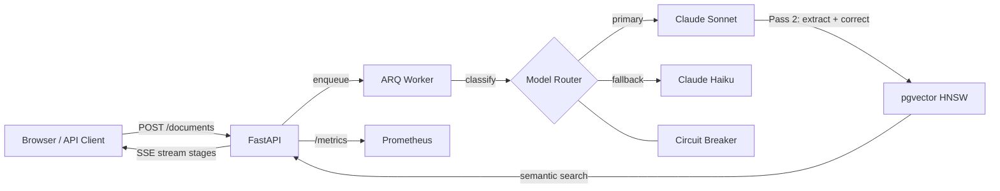
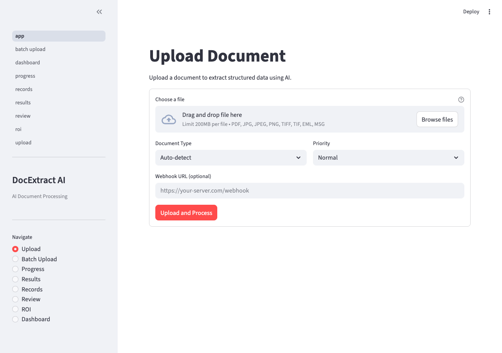
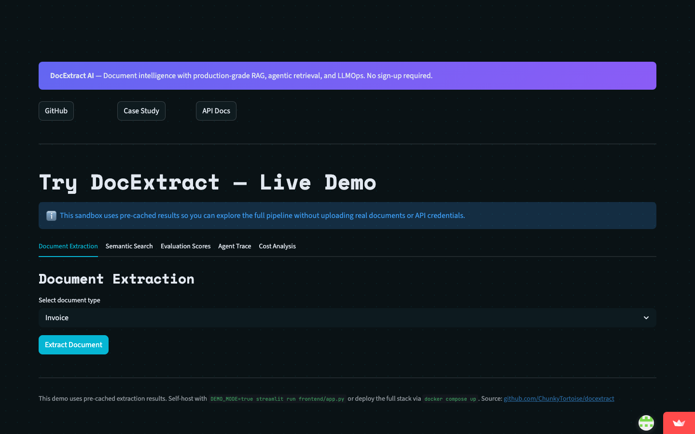
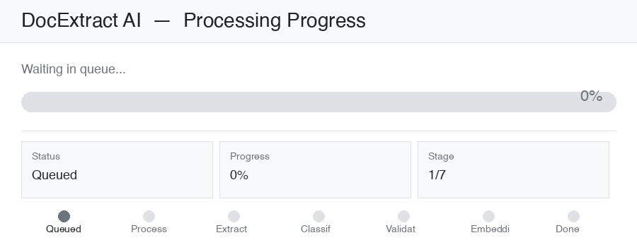

# DocExtract AI

**Extract structured data from unstructured documents in seconds — not hours.**

[](https://github.com/ChunkyTortoise/docextract/actions/workflows/ci.yml)
[](https://codecov.io/gh/ChunkyTortoise/docextract)
[](LICENSE)
[](https://python.org)
[](https://fastapi.tiangolo.com)

## Production Architecture

DocExtract runs as a production system with observability, evaluation gates, and resilience built in:

- **Sync Sidecar Pattern**: Non-blocking Langfuse trace submission via FastAPI BackgroundTasks. Request path is never blocked by observability.
- **Langfuse Cloud Tracing**: Every extraction, search, and review action is traced with model calls, token usage, latency, and confidence scores. PII is sanitized before trace submission.
- **Tiered Evaluation CI Gates**: Deterministic schema/regex checks on every PR. LLM-as-a-judge (DeepEval) runs nightly against a 92.6% accuracy golden baseline. Deployment blocks if quality regresses.
- **Circuit Breaker Failover**: Sonnet-to-Haiku model fallback chain with configurable thresholds. Prometheus gauge tracks breaker state.
- **Cost Tracking**: Per-request USD breakdown. Semantic cache hit/miss/cost-saved counters. Model A/B testing with z-test significance.
- **Infrastructure**: Docker multi-stage builds, Kubernetes (Kustomize + HPA), AWS Terraform IaC (RDS + ElastiCache), GitHub Actions CI/CD publishing to GHCR.

## Try the Demo

Explore the full pipeline without uploading real documents:

```bash
DEMO_MODE=true streamlit run frontend/app.py
```

Or visit the hosted dashboard (demo data pre-loaded).

**Demo includes:** document extraction with confidence scores, hybrid semantic search, RAGAS evaluation metrics, cost dashboard, and architecture diagram.

## Architecture



## Screenshots

| Upload & Extraction | Extracted Records & ROI |
|---------------------|------------------------|
|  |  |

### SSE Streaming Demo



*Real-time progress: PREPROCESSING → EXTRACTING → CLASSIFYING → VALIDATING → EMBEDDING → COMPLETED*

## Features

- **5 document types**: PDF, images (PNG/JPEG/TIFF/BMP/GIF/WebP), email (.eml/.msg), and plain text
- **Two-pass Claude extraction**: Pass 1 extracts structured JSON with a confidence score. If confidence < 0.80, Pass 2 fires a `tool_use` correction call for automatic error correction
- **Circuit breaker model fallback**: Per-model circuit breakers (CLOSED/OPEN/HALF_OPEN) with automatic Sonnet → Haiku failover. Configurable via `EXTRACTION_MODELS` / `CLASSIFICATION_MODELS`
- **Golden eval CI gate**: 16 fixture-based eval cases run in CI with 2% regression tolerance — extraction quality is a first-class CI signal
- **OpenTelemetry + Prometheus**: LLM call latency, token usage, and call counts exposed at `/metrics`. Enable with `OTEL_ENABLED=true`
- **Per-document-type confidence thresholds**: Identity documents require 0.90 confidence; receipts tolerate 0.75. Configurable per type via `CONFIDENCE_THRESHOLDS`
- **Hybrid search (BM25 + vector RRF)**: Semantic search combined with BM25 keyword matching via reciprocal rank fusion. Use `?mode=hybrid` on the search endpoint for best recall
- **Structured table extraction**: Tables in PDFs are extracted as structured JSON (headers + rows), not flattened to markdown text
- **Page-by-page streaming for long PDFs**: Multi-page PDFs emit partial extraction results per page via SSE — no need to wait for the full document
- **Vision-native extraction path**: Set `OCR_ENGINE=vision` to route image documents directly through Claude's vision API, bypassing Tesseract entirely
- **Active learning from HITL corrections**: Approved corrections feed back into extraction prompts via `ACTIVE_LEARNING_ENABLED=true`
- **MCP tool server**: Connect Claude Desktop or any MCP-compatible agent to extract documents and search records via `mcp_server.py`
- **Streaming Agent Reasoning (SSE)** — Real-time Server-Sent Events stream of Think → Act → Observe steps as the agentic RAG loop executes. Each reasoning step is emitted as an SSE event, enabling live UI updates. POST `/api/v1/agent-search/stream`
- **Multi-Document Synthesis** — Map-reduce RAG across multiple documents. For each document, extracts relevant passages (map), then synthesizes a combined answer with per-document citations (reduce). Concurrent LLM orchestration via `asyncio.gather` + `Semaphore`. POST `/api/v1/agent-search/synthesize`
- **Semantic Caching** — Caches LLM responses by embedding cosine similarity (not exact match). Sub-millisecond lookup via numpy batch cosine distance. TTL-based expiry, FIFO eviction, Prometheus hit/miss/cost-saved counters. Feature-flagged (`SEMANTIC_CACHE_ENABLED`). GET `/api/v1/cache/stats`
- **Fine-Tuning Data Pipeline** — Exports HITL corrections as training datasets: supervised JSONL (OpenAI format), DPO pairs (chosen/rejected for RLHF), and evaluation JSONL. Deduplication, train/val split, doc_type filtering. GET `/api/v1/finetune/export` + `/finetune/stats`
- **Agentic RAG (ReAct)** — ReAct think-act-observe loop with 5 retrieval tools (vector, BM25, hybrid, metadata, rerank). Agent autonomously selects strategy per query. Confidence-gated at 0.8 with max 3 iterations. POST `/api/v1/agent-search`
- **RAGAS Evaluation Pipeline** — Context recall, faithfulness, and answer relevancy metrics computed via LLM-as-judge with structured rubric and few-shot examples. CI quality gate blocks merges on regression. Feature-flagged (`RAGAS_ENABLED`, `LLM_JUDGE_ENABLED`).
- **Structured Output Extraction** — Per-document-type Pydantic schemas (Invoice, Contract, Receipt, Medical Record) with field-level confidence scores. Batch processing with `asyncio.gather` + `Semaphore(5)`. POST `/api/v1/extract/structured`
- **Cost Tracker & Model A/B Testing** — Per-request USD cost computation using Decimal arithmetic from `llm_traces`. SHA-256 deterministic variant routing with z-test statistical significance (n≥30). Cost comparison dashboard in Streamlit.
- **Prompt Versioning & Regression Testing** — Semver-tagged prompts stored as `prompts/{category}/vX.Y.Z.txt`. Env-configurable active version. Automated golden eval comparison with 2% regression threshold.
- **Interactive Demo Sandbox** — Full pipeline demo without API keys (`DEMO_MODE=true`). Pre-cached extraction, search, and evaluation results. Three-tab experience.
- **SSE streaming progress**: Real-time job status updates via Server-Sent Events (Redis pub/sub)
- **HNSW vector search**: pgvector semantic search over extracted records (gemini-embedding-2-preview, 768-dim)
- **Human review workflow**: Claim, approve, or correct low-confidence extractions with full audit trail
- **ROI tracking**: Executive report generation with extraction cost/time analytics
- **SHA-256 deduplication**: Identical file uploads return existing job IDs instantly
- **Webhook delivery**: HMAC-SHA256 signed payloads with 4-attempt exponential retry
- **Sliding-window rate limiting**: Per-API-key Redis rate limiter with `X-RateLimit-*` headers
- **AES-GCM encrypted secrets**: Webhook signing secrets encrypted at rest
- **Pluggable storage**: Local filesystem or Cloudflare R2

## Performance

| Metric | Value |
|--------|-------|
| Document extraction (p50) | ~8s (two-pass Claude) |
| SSE first token (p50) | <500ms |
| Semantic search (p95) | <100ms |
| Extraction accuracy (golden eval) | **92.6%** across 6 document types |
| Test suite | ~5s (1,109 tests) |
| Coverage | 90.66% (CI-enforced) |

## Business Impact

- Reduces manual document review from hours to seconds
- 92.6% extraction accuracy measured against 16 golden eval fixtures
- Circuit breaker model fallback ensures continuity during provider outages
- Async pipeline handles concurrent uploads without blocking

## Try It Now

Self-hosted: `docker compose up` — see [Deployment](#deploy-your-own).

```bash
# Health check (no auth)
curl http://localhost:8000/api/v1/health

# List records (demo key)
curl -H "X-API-Key: demo-key-docextract-2026" \
  http://localhost:8000/api/v1/records
```

## Deploy Your Own

### Render (one-click)

[](https://render.com/deploy?repo=https://github.com/ChunkyTortoise/docextract)

One-click deploy via Render Blueprint. Sets `DEMO_MODE=true` automatically. You only need to add your `ANTHROPIC_API_KEY`.

### Kubernetes (Kustomize)

Full manifest set under `deploy/k8s/` — Deployments, Services, Ingress, HPA, ConfigMap, and Secrets template for all three services (API, Worker, Frontend).

```bash
# Deploy base manifests (fill in secrets.yaml first)
kubectl apply -k deploy/k8s/

# Deploy production overlay (3 replicas, higher resource limits)
kubectl apply -k deploy/k8s/overlays/production/
```

Architecture:
- **API**: 2 replicas (base), HPA scales to 8 on CPU >70%
- **Worker**: 2 replicas (base), HPA scales to 6 — higher memory limit for Tesseract OCR
- **Ingress**: nginx class, routes `/api` and `/docs` to API, `/` to Streamlit frontend
- **SSE**: `nginx.ingress.kubernetes.io/proxy-buffering: "off"` ensures job progress streams are delivered in real time

```bash
# Validate manifests (no cluster required)
kubectl kustomize deploy/k8s/ | kubectl apply --dry-run=client -f -
```

### AWS (EC2 + ECR + S3)

Full IaC under `deploy/aws/` — Terraform provisions an EC2 instance (t2.micro), two ECR repositories, S3 document storage, **RDS PostgreSQL 16** (db.t3.micro, pgvector via migration 002), and **ElastiCache Redis 7** (cache.t3.micro). All free-tier eligible.

```bash
# 1. Provision infrastructure
cd deploy/aws
terraform init
terraform apply \
  -var="key_pair_name=your-key-pair" \
  -var="anthropic_api_key=$ANTHROPIC_API_KEY" \
  -var="gemini_api_key=$GEMINI_API_KEY" \
  -var="db_password=your-secure-db-password"

# 2. Build and push images to ECR
cd ../..
make aws-push AWS_REGION=us-east-1

# 3. EC2 user_data runs migrations (alembic upgrade head) then starts API + ARQ worker
terraform -chdir=deploy/aws output api_url
```

The instance uses an IAM role with scoped ECR pull + S3 read/write permissions (no static credentials). RDS and ElastiCache are in private subnets — only the EC2 security group can reach them.

## API Reference

All endpoints are prefixed with `/api/v1`. Authenticated endpoints require `X-API-Key` header.

| Method | Path | Auth | Description |
|--------|------|------|-------------|
| `GET` | `/health` | No | Basic health check |
| `GET` | `/health/detailed` | No | Health with DB/Redis/storage status |
| `POST` | `/documents/upload` | Yes | Upload a document for extraction (202) |
| `POST` | `/documents/batch` | Yes | Batch upload multiple documents (202) |
| `DELETE` | `/documents/{document_id}` | Yes | Delete a document and its data |
| `GET` | `/jobs` | Yes | List jobs with optional status filter |
| `GET` | `/jobs/{job_id}` | Yes | Get job status and details |
| `GET` | `/jobs/{job_id}/record` | Yes | Get extracted record for a job |
| `PATCH` | `/jobs/{job_id}` | Yes | Cancel a running job |
| `GET` | `/jobs/{job_id}/events` | Yes | SSE stream of job progress events |
| `GET` | `/records` | Yes | List extracted records (paginated) |
| `GET` | `/records/search` | Yes | Semantic search over records (`?mode=vector\|bm25\|hybrid`, default: `vector`) |
| `GET` | `/records/export` | Yes | Stream records as CSV or JSON |
| `GET` | `/records/{record_id}` | Yes | Get a single extracted record |
| `PATCH` | `/records/{record_id}/review` | Yes | Submit review for a record |
| `POST` | `/webhooks/test` | Yes | Send a test webhook payload |
| `GET` | `/stats` | Yes | Aggregate dashboard statistics |
| `POST` | `/api-keys` | Admin | Create a new API key |
| `GET` | `/api-keys` | Admin | List all API keys |
| `DELETE` | `/api-keys/{key_id}` | Admin | Revoke an API key |
| `GET` | `/review/items` | Yes | List review queue items |
| `POST` | `/review/items/{item_id}/claim` | Yes | Claim a review item |
| `POST` | `/review/items/{item_id}/approve` | Yes | Approve a review item |
| `POST` | `/review/items/{item_id}/correct` | Yes | Submit corrections for a review item |
| `GET` | `/review/metrics` | Yes | Review queue metrics |
| `GET` | `/roi/summary` | Yes | ROI summary with date range filter |
| `GET` | `/roi/trends` | Yes | ROI trends by week or month |
| `POST` | `/reports/generate` | Admin | Generate an executive report |
| `GET` | `/reports` | Admin | List generated reports |
| `GET` | `/reports/{report_id}` | Admin | Get a specific report |
| `POST` | `/api/v1/agent-search` | Yes | Query documents with autonomous ReAct retrieval agent |
| `POST` | `/api/v1/extract/structured` | Yes | Extract typed structured data from a document |
| `POST` | `/api/v1/extract/structured/batch` | Yes | Batch structured extraction (async, semaphore-limited) |

## Quickstart

```bash
git clone https://github.com/ChunkyTortoise/docextract.git
cd docextract
cp .env.example .env  # fill in ANTHROPIC_API_KEY + GEMINI_API_KEY at minimum
alembic upgrade head   # apply database migrations
docker-compose up
```

Services start on:
- **API**: http://localhost:8000 (docs at `/docs`)
- **Frontend**: http://localhost:8501
- **PostgreSQL**: localhost:5432
- **Redis**: localhost:6379

Seed a dev API key:

```bash
docker-compose exec api python -m scripts.seed_api_key
```

## Environment Variables

| Variable | Required | Description |
|----------|----------|-------------|
| `DATABASE_URL` | Yes | PostgreSQL connection string (asyncpg driver added automatically) |
| `REDIS_URL` | Yes | Redis connection string |
| `ANTHROPIC_API_KEY` | Yes | Anthropic API key for Claude extraction |
| `API_KEY_SECRET` | Yes | Secret for hashing API keys (32+ chars) |
| `AES_KEY` | No | Base64-encoded 32-byte key for AES-GCM webhook secret encryption |
| `GEMINI_API_KEY` | Yes | Required for Gemini embeddings |
| `STORAGE_BACKEND` | No | `local` (default) or `r2` |
| `STORAGE_LOCAL_PATH` | No | Local file storage path (default: `./storage/local`) |
| `R2_ACCOUNT_ID` | No | Cloudflare R2 account ID |
| `R2_ACCESS_KEY_ID` | No | Cloudflare R2 access key |
| `R2_SECRET_ACCESS_KEY` | No | Cloudflare R2 secret key |
| `R2_BUCKET_NAME` | No | R2 bucket name (default: `docextract`) |
| `CORS_ORIGINS` | No | JSON array of allowed origins |
| `LOG_LEVEL` | No | Logging level (default: `INFO`) |
| `MAX_FILE_SIZE_MB` | No | Max upload size in MB (default: `50`) |
| `MAX_PAGES` | No | Max PDF pages to process (default: `100`) |
| `OCR_ENGINE` | No | `tesseract`, `paddle`, or `vision` (default: `tesseract`). Use `vision` to route images through Claude's vision API |
| `EXTRACTION_CONFIDENCE_THRESHOLD` | No | Global two-pass fallback threshold (default: `0.8`) |
| `CONFIDENCE_THRESHOLDS` | No | JSON dict of per-type thresholds, e.g. `{"invoice":0.80,"identity_document":0.90}` |
| `VISION_EXTRACTION_ENABLED` | No | Route image MIMEs through vision extractor instead of OCR (default: `false`) |
| `ACTIVE_LEARNING_ENABLED` | No | Feed approved HITL corrections back into extraction prompts (default: `false`) |
| `DEMO_MODE` | No | Enable demo mode with read-only access (default: `false`) |
| `DEMO_API_KEY` | No | API key for demo access (default: `demo-key-docextract-2026`) |

## Running Tests

```bash
pytest tests/ -v  # 1,109 tests, ~5s
```

## Project Structure

```
app/
  api/          -- FastAPI route modules (10 routers)
  auth/         -- API key auth + rate limiting middleware
  models/       -- SQLAlchemy models (8 tables)
  schemas/      -- Pydantic request/response schemas
  services/     -- Extraction, classification, embedding, validation
  storage/      -- Pluggable storage backends (local, R2)
  utils/        -- Hashing, MIME detection, token counting
worker/         -- ARQ async job processor
frontend/       -- Streamlit 14-page dashboard
alembic/        -- Database migrations (001-010)
scripts/        -- Seed scripts (API keys, sample docs, cleanup)
tests/          -- Unit + integration tests
```

## Local Demo

Self-hosted via Docker Compose. See [Quickstart](#quickstart) above.

- **API**: http://localhost:8000
- **Frontend**: http://localhost:8501
- **Demo API key**: `demo-key-docextract-2026`
- **Docs**: http://localhost:8000/docs (Swagger UI)

> **Tip**: Set `DEMO_MODE=true` in your `.env` to explore the full pipeline without API keys or real documents.

## Benchmarks

### Golden Eval (16 fixtures, no API credits required)

Measured against 16 hand-crafted golden fixtures covering all 6 document types. Scores are field-level F1 (token overlap) between extracted JSON and golden ground truth. Run in CI on every push.

| Document Type | Accuracy |
|---------------|---------|
| Invoice | 95.0% |
| Purchase Order | 96.4% |
| Bank Statement | 91.6% |
| Medical Record | 98.9% |
| Receipt | 82.1% |
| Identity Document | 81.4% |
| **Overall** | **92.6%** |

```bash
# Reproduce locally (no API calls):
python scripts/run_eval_ci.py --ci
```

### SROIE Receipt Benchmark

DocExtract is evaluated against the [SROIE](https://github.com/zzzDavid/ICDAR-2019-SROIE) receipt benchmark (4 fields: company, date, address, total).

```bash
python scripts/benchmark_sroie.py --dry-run
```

*Full SROIE evaluation requires the dataset download and Anthropic API credits. See `scripts/benchmark_sroie.py --help`.*

## MCP Integration

DocExtract ships with an [MCP](https://modelcontextprotocol.io) (Model Context Protocol) tool server. Connect it to Claude Desktop, Cursor, or any MCP-compatible agent to extract documents and search records directly from your AI assistant.

### Tools

| Tool | Description |
|------|-------------|
| `extract_document` | Download a document from a URL, extract structured data, return the full record |
| `search_records` | Semantic search over all extracted records |

### Setup

```bash
pip install mcp
export DOCEXTRACT_API_URL=http://localhost:8000/api/v1
export DOCEXTRACT_API_KEY=your-api-key
python mcp_server.py
```

### Claude Desktop Configuration

Add to `~/Library/Application Support/Claude/claude_desktop_config.json`:

```json
{
  "mcpServers": {
    "docextract": {
      "command": "python",
      "args": ["/path/to/docextract/mcp_server.py"],
      "env": {
        "DOCEXTRACT_API_URL": "http://localhost:8000/api/v1",
        "DOCEXTRACT_API_KEY": "your-api-key"
      }
    }
  }
}
```

Once connected, you can ask Claude: *"Extract the invoice at [URL] and tell me the total amount due."*

Full setup guide and tool reference: [docs/mcp-integration.md](docs/mcp-integration.md). Built with the same patterns as [mcp-server-toolkit](https://github.com/ChunkyTortoise/mcp-server-toolkit) (`pip install mcp-server-toolkit`) — a PyPI package providing production MCP server boilerplate with caching, rate limiting, and OpenTelemetry instrumentation.

## Production Observability

DocExtract is built for production monitoring from day one.

### Full Observability Stack (Jaeger + Prometheus + Grafana)

Spin up the complete monitoring stack with a single command:

```bash
docker compose -f docker-compose.yml -f docker-compose.observability.yml up
```

| Service | URL | What you see |
|---------|-----|--------------|
| Jaeger | http://localhost:16686 | Distributed traces per document extraction |
| Prometheus | http://localhost:9090 | Raw metrics with PromQL |
| Grafana | http://localhost:3000 (admin/admin) | Pre-built dashboard: latency, throughput, tokens, circuit breaker state |

### OpenTelemetry + Prometheus

Enable with `OTEL_ENABLED=true`. Exposes a `/metrics` endpoint in Prometheus format:

| Metric | Type | Labels |
|--------|------|--------|
| `llm_call_duration_ms` | Histogram | `model`, `operation`, `status` |
| `llm_calls_total` | Counter | `model`, `operation`, `status` |
| `llm_tokens_total` | Counter | `model`, `direction` |
| `circuit_breaker_state` | Gauge | `model` — 0=CLOSED, 1=HALF_OPEN, 2=OPEN |

```bash
OTEL_ENABLED=true uvicorn app.main:app --reload
curl http://localhost:8000/metrics
```

### Distributed Tracing (OTLP/Jaeger)

Enable span export by setting `OTEL_EXPORTER_OTLP_ENDPOINT`:

```bash
OTEL_ENABLED=true \
OTEL_EXPORTER_OTLP_ENDPOINT=http://jaeger:4317 \
uvicorn app.main:app --reload
```

Works with any OTLP-compatible backend: Jaeger, Grafana Tempo, Honeycomb, Datadog.

### Circuit Breaker Model Fallback

Each model in the fallback chain has its own circuit breaker (CLOSED → OPEN → HALF_OPEN state machine). When the primary model (Claude Sonnet) trips its circuit, traffic automatically routes to Claude Haiku without any downtime.

Configure via environment:

```bash
EXTRACTION_MODELS=claude-sonnet-4-6,claude-haiku-4-5-20251001
CLASSIFICATION_MODELS=claude-haiku-4-5-20251001,claude-sonnet-4-6
CIRCUIT_BREAKER_FAILURE_THRESHOLD=5
CIRCUIT_BREAKER_RECOVERY_SECONDS=60
```

### LLM Call Tracing

Every LLM call is traced with model, operation, latency, token counts, and confidence score — stored in PostgreSQL and queryable via the `/stats` endpoint. View per-model cost trends, p95 latency, and error rates.

## Cost & Performance

Token cost comparison across models (per 1,000 tokens, as of 2026):

| Model | Input | Output | Best For |
|-------|-------|--------|----------|
| Claude Sonnet 4.6 | $0.003 | $0.015 | Complex extraction, high accuracy |
| Claude Haiku 4.5 | $0.00025 | $0.00125 | Classification, simple queries |
| Claude Opus 4.6 | $0.015 | $0.075 | Evaluation, edge cases |

DocExtract routes 60% of classification traffic to Haiku after A/B testing showed <2% quality difference vs Sonnet — reducing classification costs by ~67%.

Track live cost-per-query in the [Cost Dashboard](frontend/pages/cost_dashboard.py).

| Model | Operation | Avg Cost/Request | Avg Latency |
|-------|-----------|-----------------|-------------|
| claude-sonnet-4-6 | Extraction (2-pass) | $0.004–$0.012 | 1.8s |
| claude-haiku-4-5 | Classification | $0.0003–$0.001 | 0.4s |
| claude-sonnet-4-6 | LLM Judge | $0.002–$0.006 | 1.2s |

**Model routing strategy:** Classification and re-ranking use Haiku (4x cheaper, <5% quality gap).
Full extraction uses Sonnet. LLM judge uses Sonnet for accuracy.
A/B testing with z-test significance determines optimal model allocation per operation.

Cost monitoring: `/api/v1/metrics` (Prometheus) + Cost Dashboard in Streamlit frontend.

## Known Limitations

- **Tesseract degradation on handwriting**: OCR accuracy drops significantly on handwritten documents or forms with mixed print/handwriting. Set `OCR_ENGINE=vision` to route image documents through Claude's vision API instead, which handles handwriting substantially better.
- **English-only extraction prompts**: Extraction and classification prompts are optimized for English-language documents. Non-English documents may extract with lower accuracy.

## Architecture Decisions

12 Architecture Decision Records (ADRs) document the key design choices: [docs/adr/](docs/adr/)

| ADR | Decision |
|-----|----------|
| [ADR-0001](docs/adr/0001-arq-over-celery.md) | ARQ over Celery for async job queue |
| [ADR-0002](docs/adr/0002-pgvector-over-dedicated-vector-db.md) | pgvector over Pinecone/Weaviate |
| [ADR-0003](docs/adr/0003-two-pass-extraction.md) | Two-pass Claude extraction with confidence gating |
| [ADR-0006](docs/adr/0006-circuit-breaker-model-fallback.md) | Circuit breaker model fallback chain |
| [ADR-0011](docs/adr/0011-api-key-auth-over-oauth-jwt.md) | API key auth over OAuth/JWT |
| [ADR-0012](docs/adr/0012-pluggable-storage-local-r2.md) | Pluggable storage backend (Local/R2) |

## Technical Deep Dive

For a detailed breakdown of the architecture decisions, RAG pipeline design, extraction accuracy benchmarks, and async job queue patterns, see the [Case Study](CASE_STUDY.md). This document covers the full engineering journey from prototype to production.

## Service Level Objectives

| Metric | Target |
|--------|--------|
| Field-level extraction accuracy | >= 92% (CI-gated, 2% regression tolerance) |
| Single-page extraction p95 | < 8s |
| Multi-page extraction p95 | < 45s (10 pages, streamed) |
| Semantic search p95 | < 200ms |
| API uptime | 99.5% monthly |
| Circuit breaker recovery | < 60s after provider restoration |
| Cost per 1,000 documents | < $25 blended (Sonnet/Haiku) |

Full SLO definitions with error budgets: [docs/slo.md](docs/slo.md)

## Production Readiness

This service is designed for production deployment with:

- **Reliability**: Circuit breaker model fallback, queue-based async processing, Redis-backed rate limiting, HMAC-signed webhook delivery with 4-attempt retry
- **Observability**: OpenTelemetry traces (Jaeger/Tempo), Prometheus metrics (`/metrics`), LLM cost/latency tracking, Grafana dashboards
- **Quality gates**: Golden eval CI gate (92% threshold), RAGAS evaluation, confidence-based two-pass correction
- **Infrastructure**: K8s manifests with HPA auto-scaling, AWS Terraform (RDS + ElastiCache), multi-stage Docker builds
- **Security**: API key authentication, webhook HMAC signing, rate limiting, bandit static analysis in CI

| Document | Purpose |
|----------|---------|
| [SLO Targets](docs/slo.md) | Latency, availability, quality, cost targets |
| [Common Failure Runbook](docs/runbooks/common-failures.md) | Circuit breaker, Redis, DB, queue, vector index recovery |
| [Security Guide](docs/SECURITY.md) | API keys, webhooks, CORS, data handling |
| [Release Checklist](docs/release_checklist.md) | Pre-deploy verification steps |
| [Client Onboarding](docs/client_onboarding_runbook.md) | Setup guide for new deployments |
| [Prometheus Alerts](deploy/prometheus/alerts.yml) | SLO breach alerting rules |

## Cost Calculator

| Document Type | Model | Avg Tokens | Cost/Doc | Cost/1,000 |
|--------------|-------|------------|----------|------------|
| Invoice (1 page) | Sonnet | ~2,500 | $0.025 | $25.00 |
| Invoice (1 page) | Haiku (fallback) | ~2,500 | $0.004 | $4.00 |
| Receipt | Sonnet | ~1,200 | $0.012 | $12.00 |
| Multi-page PDF (10p) | Sonnet | ~15,000 | $0.150 | $150.00 |
| Embedding (any) | Gemini | 768-dim | $0.0004 | $0.40 |

*Costs assume Anthropic March 2026 pricing. Two-pass correction adds ~20% to base cost for low-confidence documents.*

## Troubleshooting

**Extraction returns low confidence**: Check if document is a scanned image. Set `OCR_ENGINE=vision` for better results on scans. Identity documents require 0.90 confidence; receipts tolerate 0.75 (configurable via `CONFIDENCE_THRESHOLDS`).

**Circuit breaker stuck OPEN**: Check Anthropic API status. The circuit auto-recovers within 60s of provider restoration. See [runbook](docs/runbooks/common-failures.md#1-circuit-breaker-stuck-open).

**Search returns no results**: Ensure documents have been embedded. Check `EMBEDDING_MODEL` env var. Run `GET /api/v1/records` to verify records exist.

**Demo mode not working**: Set `DEMO_MODE=true` before starting. Demo uses pre-cached results and requires no API keys.

**OTEL traces not appearing**: OTEL is disabled by default (`OTEL_ENABLED=false`). Enable it and verify `OTEL_EXPORTER_OTLP_ENDPOINT` points to your Jaeger/Tempo instance.

## Contributing

```bash
# Setup
git clone https://github.com/ChunkyTortoise/docextract.git
cd docextract
pip install -r requirements.txt -r requirements-dev.txt

# Run tests (1,060+ tests, ~90% coverage)
pytest tests/ -v --tb=short

# Lint
ruff check app/ worker/ frontend/

# Type check
mypy app/ worker/

# Run golden eval (no API key needed)
python scripts/run_eval_ci.py

# Run locally
docker-compose up  # API + Worker + Frontend + Postgres + Redis
```

PRs should pass all CI checks: lint, type check, tests (80% coverage gate), golden eval (92% accuracy gate), and Docker build.

## License

MIT
