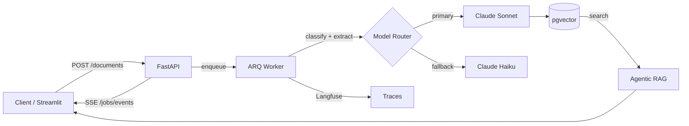

# DocExtract AI

Upload PDFs and images, classify the document, extract structured fields, and search the stored results. Classification uses cost-aware routing. Extraction uses a two-pass Claude pipeline. Embeddings are stored in pgvector. Queries run through agentic RAG. The same flow, with service boundaries, is in [What this does](#what-this-does).

## Deterministic eval replay

> **95.5% field-level score from a deterministic 28-fixture replay**

| Evidence | What it is | What it is not |
|----------|------------|----------------|
| **28 fixtures** | Deterministic replay behind the 95.5% field-level score (`scripts/eval_offline_replay.py`, `autoresearch/baseline.json`) | Not the authoring-corpus size |
| **200 cases** | Authoring corpus: 150 golden + 50 adversarial cases, stored as 202 JSONL lines including two metadata rows | Not the replay fixture total and not the score population |

The verified replay scored 28 committed prediction fixtures against 72 lookup cases, with 44 fixtures pending. Its weighted field-level accuracy is 0.9555 (95.5% rounded), not F1 or live-model performance. Retrieval recall, support and abstention remain unmeasured. See [retrieval and extraction evidence](docs/retrieval-extraction-evidence.md) for the score, populations and limitations. Held-out live eval (protocol only; performance unmeasured): [docs/held-out-live-eval-protocol.md](docs/held-out-live-eval-protocol.md).

### Reviewer path

Three paths. Run paths 1 and 2 from the repository root. Path 3 is the configured stack in [Install](#install).

**1. Offline fixture replay (no API key).** From the repository root:

```bash
python scripts/eval_offline_replay.py --floor 0.85
```

Python 3.10 or newer. The script scores committed prediction fixtures in `autoresearch/golden_responses/` against `autoresearch/eval_dataset_72.json`. Compare the weighted field-level score to **95.5%** (0.9555). Then read the [two extraction passes](docs/adr/0003-two-pass-extraction.md) and the [offline CI evidence](docs/retrieval-extraction-evidence.md).

**2. Fixture-backed UI demo (no API key).** From the repository root, with the env var documented in [DEMO.md](DEMO.md) and read by `frontend/app.py`:

```bash
DEMO_MODE=true streamlit run frontend/app.py
```

`DEMO_MODE` serves cached samples from `frontend/demo_data/`. Page order and limits: [DEMO.md](DEMO.md).

**3. Full configured services (API keys).** [Install](#install) is this path: copy `.env.example` to `.env`, set `ANTHROPIC_API_KEY` and `GEMINI_API_KEY`, then `docker compose up -d`.

Retrieval, architecture, and the scope notes below apply after any path.

[](https://github.com/ChunkyTortoise/docextract/actions/workflows/ci.yml)
[](https://github.com/ChunkyTortoise/docextract/actions/workflows/eval-gate.yml)
[](https://python.org)

The hosted Streamlit URL is intentionally omitted until anonymous access is verified. Static preview and trace visualizer live in [`site/`](site/) and [`frontend/pages/agent_trace.py`](frontend/pages/agent_trace.py).

## Eval gate {#eval-gate}

DocExtract reports extraction quality through passing or failing CI checks. Successful checks do not establish enforced merge protection. The recorded 2026-09-19 repository audit returned `Branch not protected` and an empty branch-rules list; merge blocking was not enforced in that observation. See [CI and merge enforcement](docs/retrieval-extraction-evidence.md#ci-and-merge-enforcement).

| Signal | What runs | When |
|--------|-----------|------|
| **Offline replay** (badge driver) | `scripts/eval_offline_replay.py` on 28 committed fixtures | Every eval-gated PR; zero API cost |
| **Variance-calibrated gate** | `scripts/eval_gate.py` vs `autoresearch/baseline.json` | PRs touching prompts / extraction services |
| **Paid live eval** | Promptfoo, RAGAS, LLM-judge | Only when `ANTHROPIC_API_KEY` is present in CI; skipped otherwise |
| **Held-out live protocol** | Public or synthetic docs, untouched test partition, `score_extraction` | Unmeasured until a funded run is logged ([protocol](docs/held-out-live-eval-protocol.md)) |
| **Drift cron** | Golden set vs production prompt version | Daily 13:23 UTC |

**Failing CI check demonstration:** [#32, intentional regression (keep open / expect red)](https://github.com/ChunkyTortoise/docextract/pull/32). Executed vs replayed stages: [docs/eval-gate-proof.md](docs/eval-gate-proof.md). See also [docs/eval-methodology.md](docs/eval-methodology.md).

| Metric | Value | Basis |
|--------|-------|-------|
| Extraction accuracy (field-level, critical fields weighted 2×) | **95.5%** | Always-on CI offline replay of **28** deterministic fixtures (`scripts/eval_offline_replay.py`); not a paid live grade |
| Test suite | **80% CI coverage gate** | `--cov-fail-under=80`; the changing collected-test total is intentionally omitted ([portfolio-metrics.yaml](docs/portfolio-metrics.yaml)) |
| Authoring corpus | **200 cases** (150 golden + 50 adversarial) | `evals/golden_set.jsonl` + `evals/adversarial_set.jsonl`: 202 lines including two metadata rows; separate from the 28-fixture offline replay |
| Cost / latency | See [cost-model.md](docs/cost-model.md) | Modeled only until a funded `scripts/benchmark.py` run is committed |

<details>
<summary>Verified offline replay by document type (RA11, 2026-09-19; weighted field-level accuracy)</summary>

| Document type | Score | Cases |
|---|---|---|
| invoice | 0.9669 | 13 |
| receipt | 0.9091 | 4 |
| purchase_order | 0.9745 | 3 |
| bank_statement | 0.9613 | 4 |
| medical_record | 0.9923 | 3 |
| identity_document | 0.8139 | 1 |

Overall: 0.9555 across 28 committed prediction fixtures, with 44 of 72 lookup cases pending. The historical baseline comparison score is 0.95546. This replay uses no API calls.

</details>

More: [CASE_STUDY.md](CASE_STUDY.md) · [docs/eval-methodology.md](docs/eval-methodology.md) · [docs/eval-boundary.md](docs/eval-boundary.md) · [docs/held-out-live-eval-protocol.md](docs/held-out-live-eval-protocol.md) · [evals/](evals/)


## What this does

Short form: the [opening paragraph](#docextract-ai). FastAPI document intelligence: upload PDFs and images, classify with cost-aware routing, extract structured fields via a **two-pass Claude pipeline**, embed into **pgvector**, and query with **agentic RAG** (ReAct loop with streaming SSE reasoning).

```
Upload → ARQ worker → classify → extract → validate → embed → search / agentic RAG
         ↑
    Optional trace exporters        Offline eval replay (CI only, not on request path)
```

## Why this is interesting (engineering)

- **Offline evaluation in CI**: `eval-gate.yml` replays 28 committed prediction fixtures at zero API cost and reports check status; the recorded repository audit did not show enforced merge protection
- **FastAPI & Strict Type Safety**: End-to-end Pydantic V2 validation contracts, typed error domains, and deterministic schema enforcement preventing malformed extraction persistence
- **PostgreSQL (pgvector) & ARQ Queue**: Document chunk embeddings indexed via pgvector HNSW vectors, decoupled background document processing via Redis and ARQ worker queue
- **Agentic RAG**: ReAct Think → Act → Observe over hybrid retrieval tools; primary search story in API and Streamlit ([`agentic_rag.py`](app/services/agentic_rag.py), [`agent_trace.py`](frontend/pages/agent_trace.py))
- **Cost-aware model routing**: Haiku for classification, Sonnet for extraction; prompt caching on system prompts; circuit breaker with Haiku fallback
- **Independent judge**: Gemini grades extractions to reduce self-grading bias ([ADR-0018](docs/adr/0018-independent-judge-and-multi-provider-router.md))
- **Optional observability**: Langfuse integration, LangSmith, and OpenTelemetry exporters are available when configured ([`app/observability.py`](app/observability.py))
- **Prompt-injection defense**: runtime fence + scan + output sanitization ([ADR-0020](docs/adr/0020-indirect-prompt-injection-defense.md))

## Architecture


```mermaid
graph LR
  A[Client / Streamlit] -->|POST /documents| B[FastAPI]
  B -->|enqueue| C[ARQ Worker]
  C -->|classify + extract| D{Model Router}
  D -->|primary| E[Claude Sonnet]
  D -->|fallback| F[Claude Haiku]
  E --> G[(pgvector)]
  G -->|search| H[Agentic RAG]
  H --> A
  C -->|Langfuse| I[Traces]
  B -->|SSE /jobs/events| A
```

## Demo

Run the fixture-backed demo locally with no API key:

```bash
DEMO_MODE=true streamlit run frontend/app.py
```

Progress streams over SSE: `/jobs/{id}/events` (extraction stages) and `/agent-search/stream` (agentic retrieval reasoning).

## Install

```bash
git clone https://github.com/ChunkyTortoise/docextract.git
cd docextract
cp .env.example .env  # Add ANTHROPIC_API_KEY + GEMINI_API_KEY
docker compose up -d
open http://localhost:8501  # Streamlit UI
```

Services: API `:8000` (`/docs` for Swagger) | Frontend `:8501` | PostgreSQL `:5432` | Redis `:6379`

## Tests

```bash
# Fresh clone, zero API cost:
uv venv && uv pip install -e .           # or: uv sync (installs from pyproject.toml)
pytest tests/ --collect-only -q          # Discover the current suite; count is not a portfolio claim
python scripts/eval_offline_replay.py --floor 0.85   # Always-on CI offline replay (badge driver)
python scripts/run_eval_ci.py --ci                    # Wrapper; same 28-case deterministic path
make eval                                # Optional paid live eval; requires configured credentials
```

## Architecture Decisions

20 ADRs at [docs/adr/](docs/adr/). Key decisions:

| ADR | Decision |
|-----|----------|
| [ADR-0003](docs/adr/0003-two-pass-extraction.md) | Two-pass Claude extraction with confidence gating |
| [ADR-0006](docs/adr/0006-circuit-breaker-model-fallback.md) | Circuit breaker model fallback chain |
| [ADR-0015](docs/adr/0015-prompt-caching.md) | Anthropic prompt caching for eval cost reduction |
| [ADR-0018](docs/adr/0018-independent-judge-and-multi-provider-router.md) | Gemini as independent judge |
| [ADR-0019](docs/adr/0019-reranker-and-agentic-reflection.md) | TF-IDF reranker + agentic self-reflection loop |

**Scope notes (honest):** GraphRAG hybrid retrieval is opt-in (`GRAPH_RETRIEVAL_ENABLED=false` by default): regex entity graph, file-backed. Semantic cache ([ADR-0017](docs/adr/0017-semantic-cache-l1-l2.md)) is implemented but feature-flagged off and not wired into the extraction hot path. Langfuse, LangSmith, and OpenTelemetry integrations require configuration and are not presented as verified live telemetry.

More: [DEMO.md](DEMO.md) | [docs/cost-model.md](docs/cost-model.md) | [site/](site/)

## License

MIT
