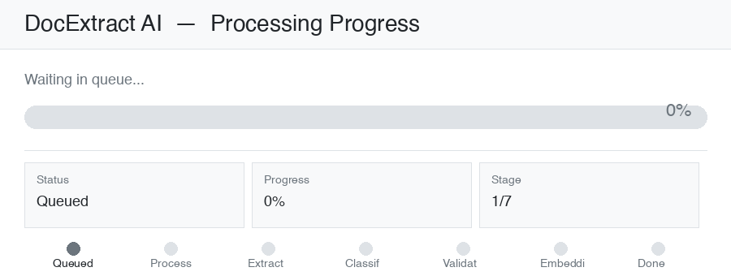
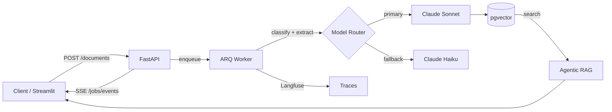

# DocExtract AI

Documents arrive as PDFs, scans, and emails; the job is to get trustworthy structured fields out without hiding uncertain results.



| Evidence | Population and method |
|----------|-----------------------|
| Replay coverage | 28 committed prediction fixtures replayed against 72 lookup cases; 44 cases have no prediction fixture and remain pending. |
| Field-level accuracy | **0.9555 (95.5% rounded)** over those 28 fixtures, aggregated with case weights by [the replay script](scripts/eval_offline_replay.py). |
| Replay split | 16 golden fixtures score 0.9264; 12 adversarial fixtures score 1.0, using the same case-weighted field-level method. |
| Scorer | Critical fields receive 2x weight. Recall only: unexpected output fields are ignored. This is not F1. |
| Authoring corpus | 200 cases (150 golden + 50 adversarial), stored as 202 JSONL lines including two metadata rows. This inventory is separate from the score population. |

From the repository root, no API key is needed. The UI command requires Streamlit installed and serves cached samples:

```bash
python scripts/eval_offline_replay.py
DEMO_MODE=true streamlit run frontend/app.py
```

**Limits:** Replay guards only the scorer and frozen fixtures; live-model quality is unmeasured; cost and latency are modeled with no metered run committed; no hosted demo URL is published.

[](https://github.com/ChunkyTortoise/docextract/actions/workflows/ci.yml)
[](https://github.com/ChunkyTortoise/docextract/actions/workflows/eval-gate.yml)

## Eval gate

Replay regressions beyond the configured tolerance fail the check. It does not catch prompt or extractor regressions; those rely on code review and the currently unfunded paid live path. Merge enforcement depends on branch settings; the [recorded audit](docs/retrieval-extraction-evidence.md#ci-and-merge-enforcement) found the branch unprotected.

| Signal | What runs | When |
|--------|-----------|------|
| Offline replay (badge driver) | Frozen response scoring with `scripts/eval_offline_replay.py` | Every eval-gate workflow run, without credentials |
| Paid live eval | Promptfoo, RAGAS, and LLM judge | When `ANTHROPIC_API_KEY` is configured in CI |
| Baseline comparison | `scripts/eval_gate.py` compares live-job artifacts with `autoresearch/baseline.json` | Within the paid live job |
| Held-out live protocol | [Procedure for an untouched test partition](docs/held-out-live-eval-protocol.md) | After API credits are available |
| Drift check | Scheduled comparison against the baseline | Daily; live stages require the paid key |

[PR #32](https://github.com/ChunkyTortoise/docextract/pull/32) deliberately fails the replay check to demonstrate a regression. The [gate proof](docs/eval-gate-proof.md) records the demonstration; [evaluation methodology](docs/eval-methodology.md) explains the workflow.

| Metric | Value | Basis |
|--------|-------|-------|
| Extraction accuracy | **95.5%** | Case-weighted field-level accuracy from offline replay of 28 committed prediction fixtures |
| Test suite | **80% CI coverage gate** | Project Python coverage enforced with `--cov-fail-under=80` |
| Authoring corpus | **200 cases** (150 golden + 50 adversarial) | Inventory of `evals/golden_set.jsonl` and `evals/adversarial_set.jsonl`: 202 lines including two metadata rows |
| Cost / latency | See [cost-model.md](docs/cost-model.md) | Pricing and call-distribution assumptions |

<details>
<summary>Offline replay by document type (case-weighted field-level accuracy)</summary>

| Document type | Score | Replayed fixtures |
|---|---|---|
| invoice | 0.9669 | 13 |
| receipt | 0.9091 | 4 |
| purchase_order | 0.9745 | 3 |
| bank_statement | 0.9613 | 4 |
| medical_record | 0.9923 | 3 |
| identity_document | 0.8139 | 1 |

For comparison, the [historical baseline](autoresearch/baseline.json) stores 0.95546 for weighted field-level accuracy on 28 committed fixtures. The [scoring reference](docs/eval-boundary.md) documents field matching and case weighting.

</details>

## What this does

FastAPI accepts uploads and queues extraction in ARQ. The worker classifies the document, runs Claude extraction and validation, flags records for human review, and stores embeddings in pgvector. Search supports vector retrieval, keyword matching, and agentic RAG.

```text
Upload → ARQ worker → classify → extract → validate → embed → search / agentic RAG
```

The [case study](CASE_STUDY.md) explains the design choices and known failure modes.

## Why this is interesting (engineering)

- **Offline evaluation in CI:** Baseline comparison, fixture-count checks, and downloadable score artifacts.
- **FastAPI and typed schemas:** Pydantic validation checks extraction shapes and records schema errors alongside results.
- **PostgreSQL and ARQ:** pgvector HNSW indexing for embeddings; Redis and ARQ keep document processing outside the upload request.
- **Agentic RAG:** A ReAct loop selects retrieval tools and streams its steps ([agentic_rag.py](app/services/agentic_rag.py), [trace viewer](frontend/pages/agent_trace.py)).
- **Model routing:** Haiku-first classification, Sonnet-first extraction, per-model circuit breakers, and prompt caching.
- **Independent judge:** Gemini-first LLM judge, off by default, CI provider configurable ([judge decision](docs/adr/0018-independent-judge-and-multi-provider-router.md)).
- **Optional observability:** Langfuse, LangSmith, and OpenTelemetry integrations ([observability.py](app/observability.py)).
- **Prompt-injection defense:** An untrusted-document fence, pattern scanning, and output sanitization ([defense decision](docs/adr/0020-indirect-prompt-injection-defense.md)).

## Architecture


```mermaid
graph LR
  A[Client / Streamlit] -->|POST /documents| B[FastAPI]
  B -->|enqueue| C[ARQ Worker]
  C -->|classify + extract| D{Model Router}
  D -->|primary| E[Claude Sonnet]
  D -->|fallback| F[Claude Haiku]
  E --> G[(pgvector)]
  G -->|search| H[Agentic RAG]
  H --> A
  C -->|Langfuse| I[Traces]
  B -->|SSE /jobs/events| A
```

## Demo

[DEMO.md](DEMO.md) walks through extraction results, search, and the agent trace viewer. The static front page lives in [site/](site/).

With the configured stack, `/jobs/{id}/events` streams extraction progress and `/agent-search/stream` streams retrieval reasoning over SSE.

## Install

Self-host with Docker Compose. Copy the example configuration, then set `ANTHROPIC_API_KEY` and `GEMINI_API_KEY` before starting the stack:

```bash
git clone https://github.com/ChunkyTortoise/docextract.git
cd docextract
cp .env.example .env
# Configure .env before starting services.
docker compose up -d
```

The [Compose file](docker-compose.yml) defines the API, worker, Streamlit frontend, PostgreSQL, Redis, and their local port mappings.

## Tests

With development dependencies installed, run from the repository root:

```bash
pytest tests/
```

Use `make eval` for the optional paid live evaluation with configured credentials. The replay command above is the offline entry point.

## Architecture Decisions

Selected decisions from [docs/adr/](docs/adr/):

| ADR | Decision |
|-----|----------|
| [ADR-0003](docs/adr/0003-two-pass-extraction.md) | Two-pass Claude extraction with confidence gating |
| [ADR-0006](docs/adr/0006-circuit-breaker-model-fallback.md) | Circuit breaker model fallback chain |
| [ADR-0015](docs/adr/0015-prompt-caching.md) | Anthropic prompt caching for eval cost reduction |
| [ADR-0018](docs/adr/0018-independent-judge-and-multi-provider-router.md) | Gemini as independent judge |
| [ADR-0019](docs/adr/0019-reranker-and-agentic-reflection.md) | TF-IDF reranker + agentic self-reflection loop |

## Scope notes

GraphRAG hybrid retrieval is opt-in (`GRAPH_RETRIEVAL_ENABLED=false` by default), using regex entities and a file-backed graph. The [semantic cache](docs/adr/0017-semantic-cache-l1-l2.md) is feature-flagged off and is not wired into the extraction hot path. Observability integrations require configuration; live telemetry has not been verified. See [SECURITY.md](SECURITY.md) for deployment limitations.

## License

MIT
