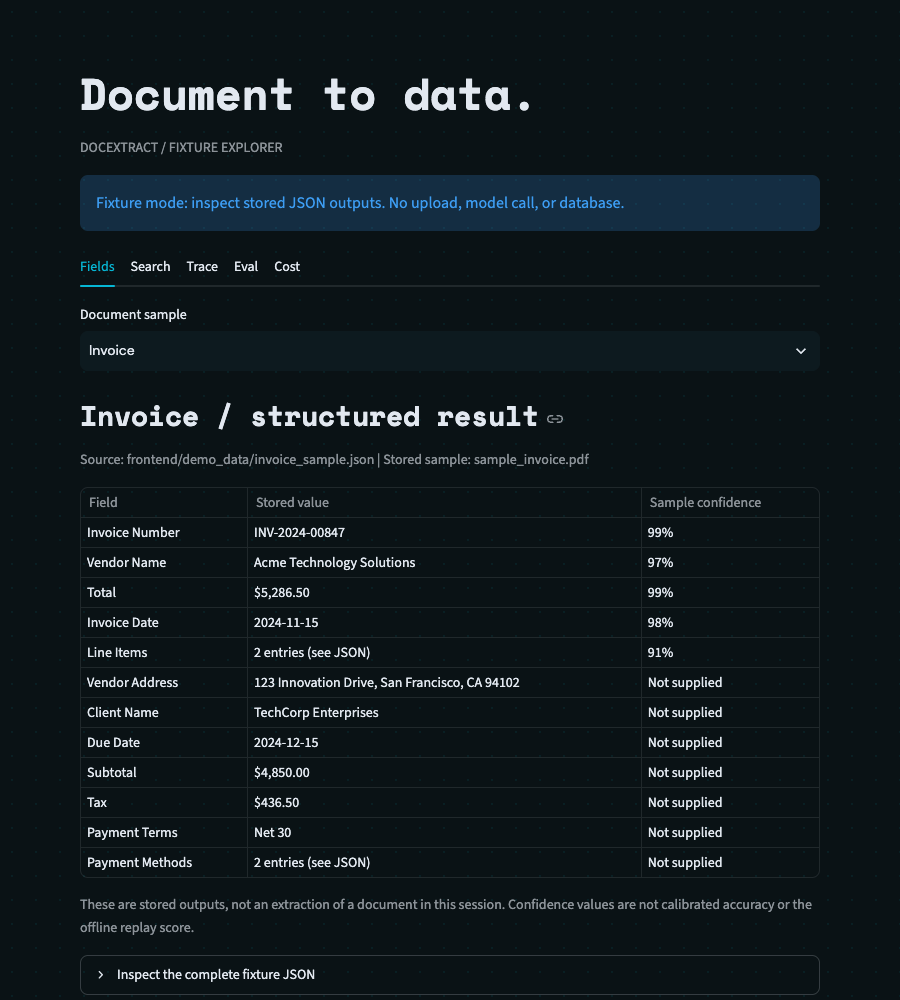
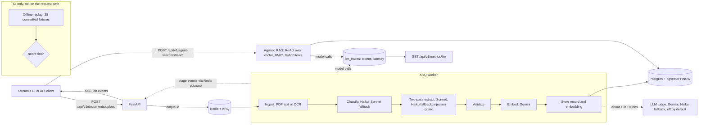
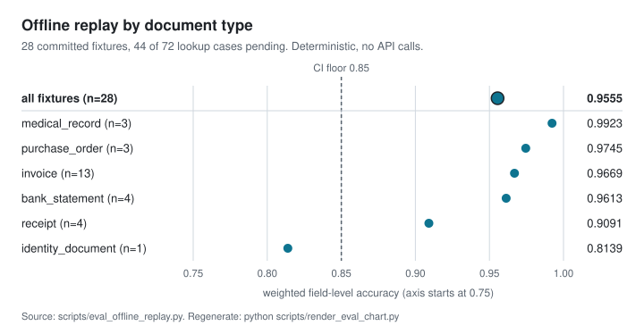

# DocExtract: document extraction with an eval gate in CI

DocExtract turns invoices, receipts, statements and other PDFs or scans into validated structured records you can search. Every pull request that touches prompts or the extractor re-scores a committed set of extraction outputs, and the check fails if the score falls below a floor or drops from baseline.

Under the hood: FastAPI, a two-pass Claude extraction pipeline, pgvector, and agentic RAG for questions over stored documents.

[](https://github.com/ChunkyTortoise/docextract/actions/workflows/ci.yml)
[](https://github.com/ChunkyTortoise/docextract/actions/workflows/eval-gate.yml)
[](https://python.org)
[](LICENSE)

<p align="center">
  
</p>
<p align="center"><sub>Fixture explorer, runnable with no API key (<a href="#quickstart-no-api-key">Quickstart</a>, step 2). <a href="docs/screenshots/fixture-walkthrough.gif">9-second walkthrough</a> · <a href="docs/screenshots/demo-mobile.png">mobile view</a> · <a href="docs/screenshots/PROVENANCE.md">capture provenance</a></sub></p>

## Results

| Kind | Result | Value | Source |
|---|---|---|---|
| Measured | Weighted field-level extraction score (critical fields 2×, partial credit for near matches) | **95.5%** on a 28-fixture offline replay | [`scripts/eval_offline_replay.py`](scripts/eval_offline_replay.py) · [`autoresearch/baseline.json`](autoresearch/baseline.json) · [evidence note](docs/retrieval-extraction-evidence.md#extraction-replay) |
| CI gate | Replay floor: the Offline replay check fails below it, or on a drop of more than 0.03 from baseline | **0.85** | [`eval-gate.yml`](.github/workflows/eval-gate.yml) · [recorded failing run](https://github.com/ChunkyTortoise/docextract/actions/runs/29670515963/job/88148512559) |
| CI gate | Test coverage floor | **80%** | [`ci.yml`](.github/workflows/ci.yml) (`--cov-fail-under=80`) · [metrics ledger](docs/portfolio-metrics.yaml) |
| Inventory | Eval authoring corpus | **200 cases** (150 golden + 50 adversarial) | [`evals/golden_set.jsonl`](evals/golden_set.jsonl) · [`evals/adversarial_set.jsonl`](evals/adversarial_set.jsonl) |
| Inventory | Architecture decision records | **20 ADRs** | [docs/adr/](docs/adr/) |

Each number is sourced in this table; other sections refer back to it. The scope of each one is in [Methodology & limits](#methodology--limits).

## Quickstart (no API key)

**1. Reproduce the replay score.** Python 3.10+, from the repository root:

```bash
python scripts/eval_offline_replay.py --floor 0.85
```

It scores the committed prediction fixtures in `autoresearch/golden_responses/` against `autoresearch/eval_dataset_72.json` and should print the combined score from the [Results](#results) table (legacy output labels it `F1`; see [Methodology & limits](#methodology--limits)).

**2. Explore stored extractions in the UI.**

```bash
python -m venv .venv-demo
.venv-demo/bin/python -m pip install -r requirements_demo.txt
.venv-demo/bin/python -m streamlit run streamlit_demo.py
```

The explorer reads committed JSON samples from `frontend/demo_data/` and makes no model or database calls. It uses a separate demo environment so Streamlit dependencies don't mix with the backend stack. On Windows, use `.venv-demo\Scripts\python`. The Fields / Search / Trace / Eval / Cost walkthrough is in [DEMO.md](DEMO.md).

**3. Run the full stack (needs API keys).**

```bash
git clone https://github.com/ChunkyTortoise/docextract.git
cd docextract
cp .env.example .env  # add ANTHROPIC_API_KEY and GEMINI_API_KEY
docker compose up -d
open http://localhost:8501  # Streamlit UI
```

Services: API `:8000` (`/docs` for Swagger) · Frontend `:8501` · PostgreSQL `:5432` · Redis `:6379`.

## How it works


```mermaid
flowchart LR
  UI["Streamlit UI or API client"] -->|"POST /api/v1/documents/upload"| API["FastAPI"]
  API -->|"enqueue"| Q[("Redis + ARQ")]
  Q --> ING
  subgraph W["ARQ worker"]
    ING["Ingest: PDF text or OCR"] --> CLS["Classify: Haiku, Sonnet fallback"]
    CLS --> EXT["Two-pass extract: Sonnet, Haiku fallback, injection guard"]
    EXT --> VAL["Validate"]
    VAL --> EMB["Embed: Gemini"]
    EMB --> STO["Store record and embedding"]
  end
  STO --> DB[("Postgres + pgvector HNSW")]
  W -.->|"stage events via Redis pub/sub"| API
  API -->|"SSE job events"| UI
  UI -->|"POST /api/v1/agent-search/stream"| RAG["Agentic RAG: ReAct over vector, BM25, hybrid tools"]
  RAG --> DB
  STO -.->|"about 1 in 10 jobs"| J["LLM judge: Gemini, Haiku fallback, off by default"]
  W -.->|"model calls"| T[("llm_traces: tokens, latency")]
  RAG -.->|"model calls"| T
  T --> M["GET /api/v1/metrics/llm"]
  subgraph CI["CI only, not on the request path"]
    R["Offline replay: 28 committed fixtures"] --> G{"score floor"}
  end
```

- **Two-pass extraction:** pass 1 extracts fields and a confidence score; a correction pass runs only when confidence falls below a per-document-type threshold ([ADR-0003](docs/adr/0003-two-pass-extraction.md)). Pydantic v2 schemas reject malformed output before it is stored.
- **Cost-aware routing:** Haiku classifies and Sonnet extracts, with prompt caching on system prompts and a circuit breaker that falls back to Haiku ([ADR-0006](docs/adr/0006-circuit-breaker-model-fallback.md), [ADR-0015](docs/adr/0015-prompt-caching.md)).
- **Agentic RAG:** a ReAct loop (think, act, observe) over vector, BM25 and hybrid retrieval tools, with reasoning streamed over SSE ([`agentic_rag.py`](app/services/agentic_rag.py), [`agent_trace.py`](frontend/pages/agent_trace.py)).
- **Prompt-injection defense:** runtime fencing, scanning and output sanitization on both the text and vision extraction paths, with adversarial tests ([ADR-0020](docs/adr/0020-indirect-prompt-injection-defense.md)).
- **Async pipeline:** an ARQ worker on Redis does the processing; pgvector HNSW stores the embeddings ([ADR-0001](docs/adr/0001-arq-over-celery.md), [ADR-0002](docs/adr/0002-pgvector-over-dedicated-vector-db.md)).
- **Versioned prompts and PII redaction in traces:** [prompt registry](app/services/prompt_registry.py) and [`pii_sanitizer.py`](app/services/pii_sanitizer.py).

Deployment artifacts: [AWS ECS Terraform](deploy/aws-ecs/), [Kubernetes manifests](deploy/) and [Grafana configuration](deploy/grafana/).

## How it's evaluated

| Signal | What runs | When |
|--------|-----------|------|
| **Offline replay** (badge driver) | `scripts/eval_offline_replay.py` on 28 committed fixtures, against the floor in [Results](#results) | Every eval-relevant PR, pushes to `main`, and a daily drift run; zero API cost |
| **Live-eval threshold gate** | `scripts/eval_gate.py`: Promptfoo, Ragas and LLM-judge outputs vs thresholds and `autoresearch/baseline.json` | Inside the paid live job when `ANTHROPIC_API_KEY` is configured in CI |
| **CI LLM judge** | `scripts/eval_llm_judge.py` grades the golden and adversarial sets. CI calls it without `--provider`, so it uses the script default (Anthropic, Claude Haiku); `--provider openai` or `gemini` is available | Paid live job only |
| **In-app judge** | Gemini 2.5 Flash, with Claude Haiku fallback, grades a sample of extractions to reduce self-grading bias ([ADR-0018](docs/adr/0018-independent-judge-and-multi-provider-router.md)) | Runtime, about 1 in 10 jobs when enabled; off by default |
| **Held-out live protocol** | Public or synthetic docs, untouched test partition, `score_extraction` | [Protocol](docs/held-out-live-eval-protocol.md) ready for a funded run |

To see the gate catch a regression, read [docs/eval-gate-proof.md](docs/eval-gate-proof.md): a demo branch corrupted eight fixtures, and the [recorded Offline replay job](https://github.com/ChunkyTortoise/docextract/actions/runs/29670515963/job/88148512559) failed below the floor. The proof note keeps the log excerpt and the commands to reproduce it.

<p align="center">
  <picture>
    <source media="(prefers-color-scheme: dark)" srcset="docs/assets/eval/replay-by-doc-type-dark.svg">
    
  </picture>
</p>

The chart is generated from the replay output by `python scripts/render_eval_chart.py`, and `tests/unit/test_render_eval_chart.py` fails if it drifts from the committed fixtures.

<details>
<summary>Replay score by document type (weighted field-level score)</summary>

| Document type | Score | Cases |
|---|---|---|
| invoice | 0.9669 | 13 |
| receipt | 0.9091 | 4 |
| purchase_order | 0.9745 | 3 |
| bank_statement | 0.9613 | 4 |
| medical_record | 0.9923 | 3 |
| identity_document | 0.8139 | 1 |

The overall score across all 28 fixtures is the Results figure. Recorded 2026-09-19 (RA11).

</details>

Run the test suite (zero API cost):

```bash
uv venv && uv pip install -e .           # or: uv sync
source .venv/bin/activate
pytest tests/ -m "not e2e" --no-cov -q
make eval                                # optional paid live eval; needs credentials
```

More: [docs/eval-methodology.md](docs/eval-methodology.md) · [docs/eval-boundary.md](docs/eval-boundary.md) · [evals/](evals/) · [CASE_STUDY.md](CASE_STUDY.md)

## Design decisions

The ADRs live in [docs/adr/](docs/adr/). The key ones:

| ADR | Decision |
|-----|----------|
| [ADR-0003](docs/adr/0003-two-pass-extraction.md) | Two-pass Claude extraction with confidence gating |
| [ADR-0006](docs/adr/0006-circuit-breaker-model-fallback.md) | Circuit breaker model fallback chain |
| [ADR-0015](docs/adr/0015-prompt-caching.md) | Anthropic prompt caching for eval cost reduction |
| [ADR-0018](docs/adr/0018-independent-judge-and-multi-provider-router.md) | Gemini as independent judge |
| [ADR-0019](docs/adr/0019-reranker-and-agentic-reflection.md) | TF-IDF reranker + agentic self-reflection loop |
| [ADR-0020](docs/adr/0020-indirect-prompt-injection-defense.md) | Indirect prompt-injection defense on text and vision paths |

## Methodology & limits

<details>
<summary>What each number covers, and what is not measured yet</summary>

**Extraction score**
- The Results score is a weighted field-level score (critical fields count 2×) from a deterministic replay of 28 committed prediction fixtures. It gives partial credit: strings by normalized Levenshtein similarity, numbers that match within one percent, and half credit when a value is extracted where null was expected ([`autoresearch/eval.py`](autoresearch/eval.py)). Unrounded values and the historical baseline are in the [evidence note](docs/retrieval-extraction-evidence.md#extraction-replay). It is not F1, even though legacy output field names contain `f1`, and it is not a live-model grade.
- The replayed outputs are frozen, so a prompt or model change does not move the replay score. The replay catches scorer, schema and fixture regressions at zero cost; prompt and model changes are measured by the paid live eval job, which runs only when an API key is configured in CI.
- Three populations are separate and must not be summed: 28 committed prediction fixtures (the score population), 72 lookup cases in `autoresearch/eval_dataset_72.json` (44 have no committed prediction fixture yet), and the authoring corpus. See [three separate denominators](docs/retrieval-extraction-evidence.md#three-separate-denominators).
- The authoring corpus is stored as 202 JSONL lines; two of them are `_meta` rows, which the Results case count excludes. It is not the replay fixture total and not the score population.
- Retrieval recall, support (faithfulness) and abstention are **unmeasured**. The replay does not execute retrieval. See [retrieval measures are separate](docs/retrieval-extraction-evidence.md#retrieval-measures-are-separate).
- Held-out live-model performance is unmeasured until a funded run is logged ([protocol](docs/held-out-live-eval-protocol.md)).

**CI and merge enforcement**
- Since 2026-10-03, branch protection on `main` requires the CI `test` check. The weighted replay (eval-gate's Offline replay job) runs on eval-relevant PRs, pushes to `main` and a daily drift schedule, and it is **not** a universal required merge check. The earlier 2026-09-19 repository audit returned `Branch not protected` and an empty branch-rules list. See [CI and merge enforcement](docs/retrieval-extraction-evidence.md#ci-and-merge-enforcement).
- PR #32 (closed unmerged) was the intentional regression behind the failing-run demo. Its check failed because the fixtures were corrupted, not because the prompt edit alone changed predictions; live stages were skipped on that run (no key). Details: [docs/eval-gate-proof.md](docs/eval-gate-proof.md).
- The live-eval threshold gate and paid live eval run only when `ANTHROPIC_API_KEY` is configured in CI and are skipped otherwise. Drift recording and drift-issue creation sit inside the paid live job; the daily 13:23 UTC schedule reruns the offline replay.

**Tests, cost and latency**
- The collected-test total changes and is intentionally omitted ([portfolio-metrics.yaml](docs/portfolio-metrics.yaml)). The coverage row in Results is the CI floor, not a measured coverage figure.
- Cost and latency are modeled only until a funded `scripts/benchmark.py` run is committed ([cost-model.md](docs/cost-model.md)).

**Demo and screenshots**
- The screenshot shows the local fixture explorer with stored invoice output. It makes no live model call. Sample confidence values are stored metadata, not calibrated accuracy or the replay score. The walkthrough GIF is three actual browser states, not continuous video ([provenance](docs/screenshots/PROVENANCE.md)).
- The hosted Streamlit URL is intentionally omitted until anonymous access is verified. A static preview and trace visualizer live in [`site/`](site/) and [`frontend/pages/agent_trace.py`](frontend/pages/agent_trace.py).
- The package requires Python 3.12+ (`pyproject.toml` `requires-python`); the standalone replay script runs on Python 3.10+.

**Feature scope**
- Deployment files are repository artifacts; a current live AWS deployment is not established here.
- PII filtering is pattern-based redaction (SSNs, credit cards, phone numbers, emails) in trace data. It does not establish complete PII detection or regulatory compliance.
- GraphRAG hybrid retrieval is opt-in (`GRAPH_RETRIEVAL_ENABLED=false` by default): regex entity graph, file-backed.
- The semantic cache ([ADR-0017](docs/adr/0017-semantic-cache-l1-l2.md)) is implemented but feature-flagged off and not wired into the extraction hot path.
- Langfuse, LangSmith and OpenTelemetry integrations require configuration and are not presented as verified live telemetry ([`app/observability.py`](app/observability.py)).
- There are two separate judges. The in-app judge (Gemini 2.5 Flash, Claude Haiku fallback) is off by default (`llm_judge_enabled = False` in `app/config.py`). The CI judge (`scripts/eval_llm_judge.py`) runs only in the paid live job, which skips without an API key, and uses its default provider (Anthropic) because the workflow passes no `--provider`.
- The two-pass figures in [ADR-0003](docs/adr/0003-two-pass-extraction.md) (trigger rate, improvement, added latency) have no committed run artifact and are not cited as results here.

**Provenance:** built under a paid client engagement; an authorized walkthrough is available on request.

</details>

## Roadmap

- Record prediction fixtures for the 44 lookup cases that do not have one yet, so the replay covers all 72 ([eval dataset](autoresearch/eval_dataset_72.json)).
- Run the [held-out live eval protocol](docs/held-out-live-eval-protocol.md) and publish live-model accuracy next to the replay score.
- Measure retrieval recall, support and abstention on a labeled query set ([what is needed](docs/retrieval-extraction-evidence.md#retrieval-measures-are-separate)).
- Replace modeled cost and latency with a metered `scripts/benchmark.py` run ([cost model](docs/cost-model.md)).

## License

MIT
