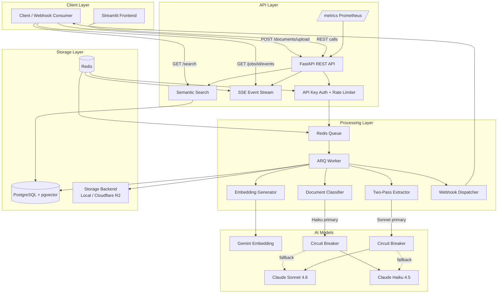

# Architecture

## System Overview

DocExtract AI is a 3-service document intelligence platform: API (FastAPI), Worker (ARQ), and Frontend (Streamlit). Documents are uploaded, classified, extracted via two-pass Claude AI, embedded into pgvector, and delivered to downstream systems via webhooks.



## Data Flow

### Extraction Pipeline (7 steps)

```
1. Upload          POST /documents/upload
                   SHA-256 dedup check → if duplicate, return existing job
                   Store raw file → Storage Backend (local or R2)
                   Enqueue job → Redis/ARQ

2. MIME Detect     Worker picks job from queue
                   python-magic identifies file type
                   Route to appropriate text extractor

3. Text Extract    PDF → pdfplumber (text-layer) or Tesseract (OCR)
                   Image → Tesseract OCR
                   Email → email.parser (headers + body + attachments)

4. Classify        Model Router → Haiku (primary) / Sonnet (fallback)
                   Circuit breaker wraps each model call
                   Returns doc_type + classification confidence

5. Extract         Pass 1: Sonnet structured JSON extraction
                   → Emits per-field confidence scores
                   Pass 2 (if confidence < 0.80): tool_use correction call
                   → Returns apply_corrections tool call, merged into Pass 1
                   Circuit breaker with Sonnet → Haiku fallback chain

6. Embed           gemini-embedding-2-preview (768-dim)
                   Store in pgvector HNSW index
                   Enables semantic search across all extracted records

7. Deliver         HMAC-signed webhook POST to configured URL
                   4-attempt exponential backoff retry
                   Redis pub/sub triggers SSE update to listening clients
```

### Search Pipeline

```
Query text → Gemini embedding (768-dim)
          → pgvector HNSW cosine similarity
          → Optional: hybrid BM25 + vector RRF fusion (?mode=hybrid)
          → Return top-k results with similarity scores
```

## Key Services

| Service | Path | Responsibility |
|---------|------|---------------|
| `claude_extractor.py` | `app/services/` | Two-pass extraction (JSON + tool_use correction) |
| `model_router.py` | `app/services/` | Route to primary/fallback model per circuit breaker state |
| `circuit_breaker.py` | `app/services/` | Per-model CLOSED/OPEN/HALF_OPEN state machine |
| `classifier.py` | `app/services/` | Document type classification |
| `semantic_cache.py` | `app/services/` | Embedding-based response dedup (feature-flagged) |
| `cost_tracker.py` | `app/services/` | Per-request USD cost computation from token counts |
| `ragas_evaluator.py` | `app/services/` | RAG quality metrics (context recall, faithfulness) |
| `agent_evaluator.py` | `app/services/` | Agentic RAG evaluation (tool selection, iteration efficiency) |
| `prompt_registry.py` | `app/services/` | Versioned prompt management with frozen registries |
| `agentic_rag.py` | `app/services/` | ReAct-loop RAG with tool_use for multi-doc synthesis |
| `finetune_exporter.py` | `app/services/` | DPO/JSONL dataset export for fine-tuning |
| `guardrails.py` | `app/services/` | PII regex detection + hallucination boundary checking |

## Failure Modes

| Failure | Detection | Recovery | Impact |
|---------|-----------|----------|--------|
| Sonnet unavailable | Circuit breaker opens after 5 failures | Auto-failover to Haiku; recovery probe every 60s | Accuracy drops ~14%, latency drops ~50% |
| Haiku unavailable | Circuit breaker opens | Failover to Sonnet for classification | Cost increases ~10x for classification |
| Redis down | Connection error on queue/rate-limit | API returns 503; queued jobs preserved in Redis AOF | No new jobs accepted; existing jobs resume on recovery |
| PostgreSQL down | Connection pool exhaustion | API returns 503; worker retries with backoff | Full outage until DB recovery |
| Gemini embedding down | API error on embed call | Skip embedding; document extracted but not searchable | Search degraded; extraction pipeline continues |
| Webhook target down | HTTP 4xx/5xx or timeout | 4-attempt exponential backoff; dead letter after exhaustion | Downstream notified late; SSE still works |
| Storage backend down | I/O error on file write | Job fails; retryable via ARQ retry policy | Upload fails; client retries |

## Technology Decisions (ADR Summary)

| ADR | Decision | Why |
|-----|----------|-----|
| [001](adr/0001-arq-over-celery.md) | ARQ over Celery | Async-native, no GIL contention, smaller footprint |
| [002](adr/0002-pgvector-over-dedicated-vector-db.md) | pgvector over Pinecone | Single storage dependency, ACID transactions, scales to ~100M vectors |
| [003](adr/0003-two-pass-extraction.md) | Two-pass extraction | Catches ~15-20% low-confidence extractions without per-document cost |
| [004](adr/0004-gemini-embeddings.md) | Gemini embeddings | 6% MRR advantage over ada-002, free tier eliminates per-embedding cost |
| [005](adr/0005-sse-over-websocket.md) | SSE over WebSocket | Unidirectional pattern, works through standard proxies |
| [006](adr/0006-circuit-breaker-model-fallback.md) | Circuit breaker fallback | Availability over marginal cost; fails fast during outages |
| [007](adr/0007-otel-bridge-over-full-migration.md) | OTel bridge (not replacement) | Custom tracer powers product features, not just ops |
| [008](adr/0008-kustomize-over-helm.md) | Kustomize over Helm | Single-app deployment, operators read YAML directly |
| [009](adr/0009-managed-dbs-rds-elasticache.md) | RDS + ElastiCache | Automated backups, point-in-time recovery, multi-AZ |
| [010](adr/0010-regex-first-guardrails.md) | Regex guardrails | Runs on every extraction; LLM call would double latency |
| [011](adr/0011-api-key-auth-over-oauth-jwt.md) | API key auth | Server-to-server integrations, binary permission model |
| [012](adr/0012-pluggable-storage-local-r2.md) | Pluggable storage (local/R2) | Zero egress cost, single env var deployment switch |

## Deployment

### Docker Compose (Default)
- API: `localhost:8000`
- Worker: ARQ background service
- Frontend: `localhost:8501`
- PostgreSQL + Redis: Docker-managed services

### AWS (Terraform)
- RDS PostgreSQL 16 + ElastiCache Redis 7
- ECS Fargate for API + Worker
- Cloudflare R2 for document storage

### Kubernetes (Kustomize)
- Base manifests in `deploy/k8s/base/`
- Production overlay in `deploy/k8s/overlays/production/`
- HPA for API + Worker pods
- Ingress with TLS termination

## Observability

- **Prometheus**: `llm_call_duration_ms`, `llm_calls_total`, `circuit_breaker_state`, custom extraction metrics
- **OpenTelemetry**: Feature-flagged span export to Jaeger/Tempo (`OTEL_ENABLED=true`)
- **Grafana**: Pre-built dashboard (`deploy/grafana/dashboard.json`) with 9 panels
- **Cost tracking**: Per-request USD via `cost_tracker.py`, exposed on `/stats` endpoint
- **Alert rules**: `deploy/prometheus/alerts.yml` (6 rules tied to SLOs)

## Cross-References

- [Case Study](../CASE_STUDY.md) - Business context and impact narrative
- [SLO Targets](slo.md) - Service level objectives and error budgets
- [Eval Guide](eval-guide.md) - How the evaluation harness works
- [Performance Baselines](performance-baselines.md) - Token usage, latency, cost data
- [Security](SECURITY.md) - API keys, webhooks, CORS, data handling
- [Runbooks](runbooks/common-failures.md) - Incident response procedures
- [MCP Integration](mcp-integration.md) - Claude Desktop / MCP server setup
